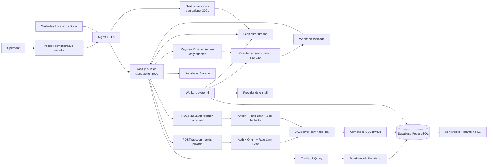

# Arquitetura end-to-end

## 1. Visão



## 2. Aplicações

### 2.1 Aplicação pública

Responsável por:

- conteúdo público;
- autenticação;
- área de locatário;
- área de dono;
- comandos de domínio;
- webhooks;
- read models SSR;
- upload assinado;
- health endpoints.

Não contém páginas ou bundles de backoffice.

#### Identidade implementada na FEAT-002

`/cadastro` entra exclusivamente em `POST /api/auth/register` com `identity.register`; o endpoint Auth convidado aceita somente esse envelope estrito, aplica origem, fachada, limite de stream e limiter específico, e então o handler server-only cria uma intenção jurídica opaca pela role `app_dal` e chama Supabase Auth sem devolver o token ao browser. `POST /api/commands` fica reservado a ações privadas e valida a sessão autoritativa antes de ler ou interpretar o body. O trigger no `INSERT` de `auth.users` trava/consome a intenção, revalida as duas versões vigentes e cria perfil mínimo + aceites na mesma transação. Login, logout, callback e recovery usam endpoints Auth específicos, enquanto sessão e documentos legais usam read models pequenos/RLS. O Proxy renova cookies por request e preserva o mesmo contrato CSP; nenhum cliente Supabase global ou service role entra no bundle.

No callback de recovery, o servidor valida `sub`, `session_id` e `exp` assinados e exige a sessão correspondente em `auth.sessions` antes de criar uma binding/tombstone privada e seu grant one-shot de 15 minutos. O UUID `session_scope` exposto à interface é somente um namespace opaco para resposta e cache; a autoridade permanece no JWT validado, na binding e no grant. Proxy e read models consultam a tombstone pelo `session_id`, portanto uma sessão Auth de recovery nunca vira login comum mesmo depois de perder os cookies auxiliares. Fechamento, expiração ou uso fora da superfície recovery encerra a sessão local, enquanto uma sessão comum sem binding permanece comum. O tempo Auth fica pinado em `3600` segundos e a ausência canônica inicia retenção conservadora antes do purge.

No cliente, `recoveryStatus(scope)` mantém scopes anônimo/UUID em queries distintas e valida que a resposta repita o mesmo recorte antes do cache. O formulário de nova senha só monta com autorização vigente, scope correspondente e `fetchStatus` ocioso; refetch ativo ou pausado conserva a fronteira fechada.

#### Dono/recebedor local da FEAT-004

`/dono` e `/dono/recebimentos` usam Server Components para sessão/read model inicial e Client Components somente nas mutations e no boundary interativo. A autoridade é `owner_profiles`; recipient/provider nunca vem de claim Auth ou papel administrativo. `POST /api/commands` recebe `expectedScope` e `idempotencyKey`, reserva a operação no DAL, chama o adapter server-only fora da transação e aplica o snapshot somente com fence de sequência. O adapter local nominal faz `start -> pending` e `refresh -> active`, é recusado fora de local/test e não realiza rede. Integração externa continua suspensa pelo ADR-018/PEND-004.

### 2.2 Backoffice

Aplicação Next.js separada em `apps/backoffice`.

Responsável por:

- revisão;
- usuários;
- taxonomias;
- reservas;
- pagamentos/reembolsos/repasses;
- fiscal;
- saúde operacional;
- auditoria.

Tem:

- porta própria;
- domínio/subdomínio próprio;
- cookies e sessão próprios;
- acesso de rede restrito;
- secrets próprios;
- build/deploy independente.

### 2.3 Workers

Processos Node server-only geridos por systemd:

- `email-outbox-worker`;
- `booking-expiration-worker`;
- `payment-reconciliation-worker`;
- `payout-worker`;
- `maintenance-worker`.

Jobs usam locks no banco e são idempotentes. Uma segunda execução não duplica efeitos.

## 3. Estrutura de repositório alvo

```text
.
├── apps/
│   └── backoffice/
│       ├── src/app/
│       ├── src/lib/
│       ├── next.config.ts
│       └── package.json
├── packages/
│   ├── contracts/
│   │   ├── commands/
│   │   ├── read-models/
│   │   └── domain/
│   └── ui/
│       ├── components/
│       ├── tokens/
│       └── styles/
├── src/
│   ├── app/
│   │   ├── api/
│   │   │   ├── commands/route.ts
│   │   │   ├── webhooks/payments/[provider]/route.ts
│   │   │   ├── health/live/route.ts
│   │   │   └── health/ready/route.ts
│   │   ├── (public)/
│   │   ├── (auth)/
│   │   ├── conta/
│   │   └── dono/
│   ├── components/
│   ├── domains/
│   └── lib/
│       ├── api/
│       ├── auth/
│       ├── queries/
│       ├── server/
│       └── supabase/
├── supabase/
│   ├── migrations/
│   ├── tests/
│   ├── seed.sql
│   └── schema.generated.sql
├── tests/
│   ├── e2e/
│   ├── integration/
│   └── helpers/
├── scripts/
├── docs/
└── package.json
```

## 4. Dependências

As dependências apontam para dentro:

```text
UI → contracts/query hooks
Route Handler → auth/validation/command handler
Command handler → DAL/provider adapter
DAL → funções SQL privadas
Read hook → read model/normalizer
Banco → invariantes do domínio
```

Proibido:

- componente importar `pg`;
- pacote UI importar domínio;
- banco depender de markup;
- provider externo definir estado de domínio diretamente;
- backoffice importar código de rota pública.

## 5. Contrato de leitura

### 5.1 Públicos

Read models públicos retornam somente estúdios publicados e campos aprovados. O browser usa chave pública e grants explícitos.

### 5.2 Privados

Read models autenticados filtram por `auth.uid()` e RLS. Backoffice usa DAL com função privada quando o dado não deve ser exposto pela Data API.

### 5.3 Formato

```ts
type CursorPage<T> = {
  items: T[];
  nextCursor: string | null;
};
```

Read model:

- colunas explícitas;
- limite defensivo;
- cursor opaco;
- filtros server-side;
- DTO validado;
- nenhuma PII não necessária.

## 6. Contrato de escrita

### 6.1 Envelope

```ts
type CommandEnvelope<A extends string, P> = {
  action: A;
  payload: P;
  idempotencyKey?: string;
};
```

### 6.2 Resposta

```ts
type CommandResponse<T> =
  | { data: T; requestId: string }
  | {
      error: {
        code: string;
        message: string;
        requestId: string;
        fieldErrors?: Record<string, string>;
      };
    };
```

### 6.3 Pipeline

- `POST` apenas;
- JSON máximo 128 KB por padrão;
- origem/host;
- sessão;
- status de conta;
- rate limit;
- Zod;
- handler;
- DAL;
- SQL;
- log;
- invalidation map.

Arquivos usam upload assinado; iCal usa limite específico de 2 MB.

## 7. Supabase

### 7.1 Serviços

- Auth: e-mail/senha, confirmação e recuperação;
- PostgreSQL: domínio;
- Storage: fotos;
- Data API/RPC: read models deliberados;
- local CLI: desenvolvimento/CI.

### 7.2 Schemas

- `public`: entidades e read models deliberadamente expostos;
- `private`: comandos/helpers;
- `audit`: eventos operacionais, se separado;
- `auth` e `storage`: gerenciados.

### 7.3 Roles

- `anon`: leitura pública mínima;
- `authenticated`: leitura própria/pública;
- `app_dal`: execução de comandos privados;
- roles internas do Supabase conforme plataforma;
- service role somente em scripts administrativos explicitamente isolados, não no caminho normal.

## 8. Estado remoto

### 8.1 Query keys

```ts
const studioKeys = {
  list: (filters: StudioFilters, cursor?: string) =>
    ["studios", "list", stableFilterKey(filters), cursor ?? "first"] as const,
  detail: (studioId: string, date?: string) =>
    ["studios", "detail", studioId, date ?? "none"] as const,
  owner: (userId: string) => ["owner", userId, "studios"] as const,
};

const reservationKeys = {
  mine: (userId: string, filter: string, cursor?: string) =>
    ["reservations", "mine", userId, filter, cursor ?? "first"] as const,
};

const ownerKeys = {
  recipientStatus: (userId: string) => ["owner", "recipient", "status", userId] as const,
};
```

### 8.2 Invalidação

Cada action declara domínios afetados. Exemplo:

| Action                   | Invalida                                            |
| ------------------------ | --------------------------------------------------- |
| `studio.revision.update` | owner studio editor                                 |
| `studio.review.approve`  | public list/detail, owner status, review queue      |
| `calendar.block.create`  | availability, owner calendar, quote                 |
| `payment.confirm`        | reservation, calendar, owner/renter lists, payments |
| `reservation.cancel`     | reservation, calendar, payments, payouts            |
| `owner.activate`         | owner recipient status                              |
| `recipient.onboarding.*` | owner recipient status e elegibilidade futura       |
| `profile.*`              | profile e owner recipient status                    |

## 9. Segurança em camadas

1. Nginx e firewall.
2. Sessão/cookie/origin.
3. Rate limit/body limit.
4. Zod.
5. handler e autorização.
6. role DAL restrita.
7. função SQL privada.
8. ownership.
9. constraints/locks.
10. RLS/grants.
11. auditoria/alerta.

## 10. Falhas e recuperação

### 10.1 Provider indisponível

- não confirmar pagamento;
- manter/expirar hold conforme estado;
- mostrar erro acionável;
- reconciliar depois;
- alertar quando limiar exceder.

### 10.2 Banco indisponível

- readiness falha;
- Nginx continua servindo erro controlado;
- nenhum provider call novo deve ocorrer sem capacidade de persistir idempotência.

### 10.3 Worker duplicado

- lock no banco;
- claim `for update skip locked`;
- idempotency key;
- efeito único.

### 10.4 Deploy falho

- health interno;
- smoke HTTPS;
- symlink anterior;
- restart;
- registro do rollback.

## 11. Portabilidade e escala

Não antecipar Kubernetes, Redis ou microserviços. Gatilhos:

- CPU/memória sustentadas;
- necessidade de múltiplas instâncias;
- fila de outbox com atraso;
- conexões saturadas;
- egress/mídia;
- latência de banco;
- indisponibilidade da VM incompatível com negócio.

Escala futura mantém contratos de comandos/read models e pode substituir runtime.
