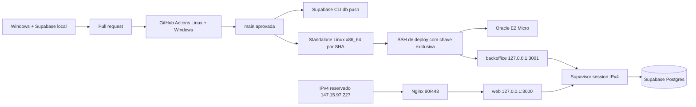

# Infraestrutura, ambientes e deploy

Esta é a fonte canônica da operação técnica. Decisões ficam nos ADRs 014, 019, 020 e 021; resultados
de uma execução pertencem ao check, deployment ou PR que os produziu.

## Contrato vigente

| Componente        | Contrato                                                                                       |
| ----------------- | ---------------------------------------------------------------------------------------------- |
| desenvolvimento   | Windows nativo, Node 24.18, npm 11.19 e Supabase local em Docker Desktop                       |
| produção de dados | Supabase Cloud `oirvvnojgkzdppkdvhej`, `sa-east-1`, sem branches remotas nesta fase            |
| produção web      | Oracle E2 Micro Always Free-eligible x86_64, Ubuntu 24.04, 50 GB, IP reservado `147.15.97.227` |
| origem web        | `https://147.15.97.227`, com indexação bloqueada até o go-live                                 |
| backoffice        | somente `127.0.0.1:3001`; exposição pública adiada                                             |
| entrega           | GitHub Actions, migrations forward-only e release imutável por SHA                             |

Não existe acceptance remoto. Testes destrutivos, seeds e usuários QA ficam exclusivamente no ambiente
local. `main` representa produção e só recebe mudanças pelo [ciclo obrigatório](review-deploy-cycle.md).

## Topologia



Produção não usa Docker, build na VM, registry de imagem, runner self-hosted, agente de polling ou login
OCI em cada merge.

## Desenvolvimento local

`npm run local:setup` inicia a stack oficial da Supabase CLI, recria o banco e grava três arquivos
ignorados: `.env.local`, `apps/backoffice/.env.local` e `.env.e2e.local`. O login DAL local é exclusivo,
assume `app_dal` e não aceita host diferente de `127.0.0.1`.

O banco local contém somente dados QA descartáveis. Não há benefício proporcional em adicionar uma
segunda camada de firewall local; a segurança essencial é nunca reutilizar credencial ou dado de
produção. Consulte [development.md](development.md).

## CI e proteção de branch

O workflow `.github/workflows/ci.yml` contém três jobs:

1. **Quality, local Supabase and browser gates**: gates estáticos, Vitest, reset e pgTAP local, suíte
   Playwright completa, build, pacote, `actionlint`, prova dos contratos Nginx/systemd/SSH, ativação,
   falhas e recuperação do instalador, além do smoke standalone Linux x86_64;
2. **Windows native contracts**: contratos TypeScript/Vitest e build/pacote no ambiente Windows;
3. **Deploy production**: somente em push de `main`, depois dos dois jobs verdes e quando
   `PRD_DEPLOY_ENABLED=true`.

Workflows de pull request não recebem secrets de produção e o checkout remove a credencial Git depois
da clonagem. Cada gate relevante possui step próprio; Actions externas são oficiais e fixadas por SHA.
Os dois primeiros nomes são contexts obrigatórios da branch protection. O terceiro context,
`Codex review contract`, não é um job: uma credencial confiável o publica somente depois do ciclo de
review limpo descrito em [review-deploy-cycle.md](review-deploy-cycle.md).

## Release e deploy

`npm run release` exige que os dois `BUILD_ID` sejam o SHA Git completo e cria somente:

```text
.artifacts/release/
├── web/
├── backoffice/
└── release-manifest.json
```

No merge, o workflow:

1. aplica migrations pendentes com `supabase db push --linked`, sem seed;
2. usa o project ref literal versionado e valida o contrato fixo antes da primeira escrita cloud;
3. inicializa a identidade restrita somente se a migration acabou de criá-la como `NOLOGIN`; nos
   deploys seguintes apenas valida a credencial existente, sem rotacioná-la ou imprimi-la;
4. constrói web e backoffice para o SHA aprovado com URL DAL estrutural não secreta;
5. recusa segredo no artifact, cria duas vezes o tar normalizado e exige bytes idênticos;
6. envia o archive e dois ambientes efêmeros pelo comando SSH forçado;
7. executa o instalador root allowlisted;
8. verifica readiness interno dos dois apps e HTTPS público durante a ativação, e repete o health
   público a partir do runner.

O instalador `ops/deploy-release.sh` valida caminho, ownership, checksum, manifesto, entrypoints,
ambientes e o digest da configuração efetivamente instalada no host. Antes de extrair limita
tamanho/quantidade e aceita somente diretórios e arquivos regulares nas três raízes esperadas. Cada
SHA ocupa `/opt/set-livre/releases/<sha>` junto aos ambientes e à identidade do mesmo SHA. A troca de
`/opt/set-livre/current` ativa essa unidade inteira, reinicia os serviços e exige readiness interno e
HTTPS público. Um marcador root-only preserva o alvo anterior até o commit do health; traps restauram
esse alvo em erro, `HUP`, `INT` ou `TERM`, e uma unit oneshot faz a mesma recuperação antes do boot dos
apps se o processo ou a VM forem interrompidos. Rollback incapaz de voltar ao readiness interno
interrompe os serviços. Um SHA existente com artifact ou ambiente diferente é recusado. A retenção
ocorre antes da ativação e mantém no máximo quatro releases, incluindo candidata e anterior.
Ordem, timestamps, owner e gzip são normalizados pelo timestamp do commit para que retry do mesmo SHA
produza o mesmo checksum.
Antes da compactação, o empacotador também recusa `.env` e ocorrências exatas das credenciais de banco
disponíveis ao processo; o artifact parcial é removido em caso de falha.

Migrations não sofrem rollback automático. Mudanças incompatíveis usam expand/contract em PRs
separados; alterações destrutivas exigem backup e recuperação comprovada.

## Host Oracle

`ops/bootstrap-host.sh` é idempotente para a VM dedicada e instala apenas:

- Node 24.18 x86_64 verificado pelos `SHASUMS256` oficiais;
- Nginx, systemd, OpenSSH, `iptables-persistent`, Fail2ban, Certbot oficial via Snap e atualizações
  automáticas;
- units systemd habilitadas, porém inativas antes da primeira release; cada unit exige seu entrypoint
  imutável e limita tentativas de restart para não criar loop em host vazio ou artefato inválido;
- pelo menos 1 GiB de swap para reduzir risco de OOM no shape de 1 GB; um arquivo existente maior e
  válido é preservado em vez de ser reescrito durante um bootstrap idempotente;
- usuários sem login separados `setlivre-web` e `setlivre-backoffice`, além de
  `deploy-setlivre` para entrega;
- units, sites Nginx, comando SSH forçado e instalador de release revisados no repositório.

Diretórios e identidades:

```text
/opt/set-livre/releases/<sha>    root:setlivre 0750
  .runtime/web.env               root:setlivre-web 0640
  .runtime/backoffice.env        root:setlivre-backoffice 0640
  .runtime/release.env           root:setlivre 0640
/opt/set-livre/current           symlink para código + ambientes do mesmo SHA
/opt/set-livre/.activation-rollback marcador transitório root:root 0600
/etc/set-livre/host-config.sha256 root:setlivre 0640
/etc/set-livre/supabase-root-2021-ca.crt root:root 0644
```

Os processos Node executam com UIDs e arquivos de ambiente separados, sem root, com `NoNewPrivileges`,
devices privados, capabilities vazias, namespaces/realtime bloqueados, filesystem protegido e apenas
AF_UNIX/IPv4/IPv6. O grupo compartilhado `setlivre` concede somente leitura do artifact e do SHA
ativo. O workflow sincroniza em cada release somente as cinco chaves esperadas (`APP_ENV`, URL DAL,
origem do app, URL e publishable key do Supabase); o instalador recusa chave extra, encoding inválido,
projeto/role/host divergente ou ambiente entre os apps inconsistente. A chave de deploy usa
`authorized_keys command=` e aceita apenas uploads limitados e `deploy <sha> <checksum>`; não abre
shell, SCP genérico ou comando arbitrário. Somente o instalador pode ser executado como root. Ambientes
antigos permanecem protegidos dentro das releases retidas e são removidos pela mesma política de
retenção; uma credencial alterada exige novo SHA, nunca reescrita silenciosa de release.

O manifesto contém o SHA-256 determinístico dos nove arquivos que definem o host. O bootstrap invalida
o marcador ativo antes de alterar essas superfícies e só publica o novo
`/etc/set-livre/host-config.sha256` por rename atômico depois de todas as validações; falha intermediária
mantém novos deploys bloqueados. Se Nginx, systemd, CA, bootstrap, comando SSH ou instalador mudarem, o
deploy falha antes da ativação até que o agente reaplique o bootstrap pela conta administrativa.

### Rede e SSH

NSG e a cadeia persistente `SETLIVRE_INPUT` expõem somente:

- `22/tcp`: SSH por chave Ed25519, sem senha/root, com bloqueio de tentativas pelo Fail2ban;
- `80/tcp`: ACME e redirecionamento para HTTPS após emissão;
- `443/tcp`: aplicação.

Portas 3000 e 3001 escutam em loopback. O deploy normal usa SSH direto e não depende da sessão OCI de
uma hora. OCI Bastion pode permanecer como acesso emergencial, mas não participa do pipeline.
O IPv4 público é reservado e regional para que DNS, trust SSH e recuperação não dependam do ciclo de
vida da VNIC. A distinção oficial entre endereços efêmeros e reservados está na
[documentação de Public IP Addresses da Oracle](https://docs.oracle.com/en-us/iaas/Content/Network/Tasks/managingpublicIPs.htm).
O bootstrap deriva o ruleset completo a partir do estado Oracle, valida-o antes da aplicação e troca
cada família com uma única transação `iptables-restore`. Snapshot de memória e arquivos persistidos são
restaurados automaticamente se qualquer etapa falhar. A cadeia `InstanceServices` fornecida pela imagem
Oracle precisa permanecer byte a byte equivalente. UFW não é instalado porque sua ativação pode remover
regras necessárias ao boot e aos volumes da instância,
risco registrado pela Oracle em
[Known Issues for Compute](https://docs.oracle.com/en-us/iaas/Content/Compute/known-issues.htm). A
aplicação imediata usa `iptables-restore` após o teste; o comando `netfilter-persistent reload` não é
usado porque a imagem Oracle configura restore sem flush e uma recarga em runtime duplicaria regras.
Timestamps e contadores são removidos do arquivo persistido para que reexecuções idênticas produzam os
mesmos bytes.

Nginx substitui `Host`, `X-Forwarded-Host`, `X-Forwarded-Proto` e `X-Forwarded-For`; o último recebe
somente `$remote_addr`, nunca uma cadeia fornecida pelo cliente. Respostas autenticadas não são
cacheadas pelo proxy. `/api/auth/*` e `/api/commands` também recebem um limiter de borda por IP, com
média de uma request por segundo, burst de 30 sem atraso e resposta `429`. Demais rotas usam chave
vazia e não consomem essa zona; os limiters específicos do app continuam sendo a segunda camada.
Hosts desconhecidos são recusados. Nesta fase, somente o Host literal `147.15.97.227` chega ao web; o
backoffice não possui virtual host público. Todas as respostas públicas recebem `X-Robots-Tag` com
`noindex`, e `/robots.txt` bloqueia crawling. A validação estrita de origem usa a mesma origem HTTPS.

## Banco de produção

A VM IPv4 usa Supavisor em **session mode**, porta 5432. O usuário de conexão segue o formato oficial
`app_runtime_production.<project-ref>`, mas a sessão PostgreSQL efetiva precisa ser
`app_runtime_production` e assumir `app_dal` por `options=-c role=app_dal`.

O contrato exige `sslmode=verify-full`. `app_runtime_production` tem limite total de dez conexões, sem
inherit, superuser, criação, replicação, bypass RLS, TEMP ou objetos próprios. A migration cria a role
como `NOLOGIN`; `scripts/provision-production-role.mjs` define a senha e habilita `LOGIN` uma única vez,
somente nesse estado inicial, e então prova uma conexão real que assume `app_dal`. Quando a role já tem
`LOGIN`, o caminho normal é estritamente de validação: secret divergente falha antes da VM sem alterar a
credencial que sustenta a release vigente. Rotação futura exige mudança operacional própria com duas
credenciais/identidades durante a transição, comprovação e retirada da anterior; não faz parte do deploy
normal. O script não imprime credenciais. Os pools usam `4 + 1 + 1 = 6` entre comandos e readiness dos dois apps, deixando
quatro slots do limite dez para verificação de deploy, recuperação e variação operacional.

A CA pública oficial do Supabase fica versionada em
`ops/certificates/supabase-root-2021-ca.crt`. CI e serviços Node a adicionam à cadeia confiável por
`NODE_EXTRA_CA_CERTS`, mantendo validação de CA e hostname. O bootstrap instala a mesma cópia em
`/etc/set-livre/supabase-root-2021-ca.crt`. Seu SHA-256 é
`807025AD50D4ED219D2C9C7D299C004F824EB00CF7F65AFEF607D07B72E6CAFA` e a validade termina em
2031-04-26; substituição exige obter a nova CA no dashboard, conferir emissor/fingerprint, testar a
conexão real e trocar repositório e host no mesmo release.

## HTTPS por IP e DNS adiado

O domínio permanece sem apontamento nesta fase por decisão explícita do responsável. A origem canônica
temporária é o IPv4 reservado em HTTPS. Let's Encrypt oferece certificados de IP de curta duração, e o
Certbot passou a suportar emissão por webroot para IP a partir da versão 5.4. O bootstrap remove a
distribuição antiga do Ubuntu, instala a versão oficial estável via Snap, exige no mínimo 5.4, prepara o
webroot ACME e habilita o timer de renovação. Referências oficiais:
[disponibilidade geral de certificados de IP](https://letsencrypt.org/2026/01/15/6day-and-ip-general-availability.html)
e [suporte no Certbot 5.4](https://letsencrypt.org/2026/03/11/shorter-certs-certbot).

Emissão e renovação do certificado exigem comprovar SAN, validade e confiança pública sem desabilitar
a verificação TLS; a VM mantém o timer de renovação ativo. O Nginx apresenta o certificado no handshake
padrão porque clientes que acessam uma URL por IP podem omitir SNI, mas somente o `Host` literal
canônico alcança a aplicação. A evidência de cada execução pertence ao deployment ou PR correspondente.

Enquanto `/etc/letsencrypt/live/147.15.97.227` não existe, o template HTTP permite somente o desafio
ACME e encerra qualquer outra conexão; a aplicação não é servida em texto claro. Depois da primeira
emissão, reexecutar o bootstrap valida prazo e SAN de IP com OpenSSL, ativa o template TLS e redireciona
HTTP. A flag de deploy só é habilitada quando
certificado, credenciais, gates e review estiverem prontos, imediatamente antes do merge aprovado. O
readiness HTTPS do SHA recém-publicado comprova então a conclusão da entrega. O timer
`snap.certbot.renew.timer` e um deploy hook versionado validam e recarregam Nginx em cada renovação.

DNS, certificado por nomes e exposição do backoffice serão uma mudança própria de go-live. Os registros
planejados permanecem em `configuration-steps.md`, mas não devem ser criados agora.

## Configuração do GitHub

Coordenadas públicas versionadas no workflow:

- project ref e URL do Supabase de produção;
- IPv4/URL pública e origem futura do backoffice.

Variáveis não secretas do repositório:

- `PRD_DEPLOY_ENABLED`;
- `PRD_SUPABASE_PUBLISHABLE_KEY`;
- `PRD_VM_SSH_HOST_KEY`.

Secrets do environment `production`:

- `SUPABASE_ACCESS_TOKEN`;
- `SUPABASE_DB_PASSWORD`;
- `PRD_DATABASE_URL_APP_DAL`;
- `VM_SSH_PRIVATE_KEY`.

O publishable key e a host key SSH são públicos por natureza; senhas, access token, URL DAL e chave SSH
privada nunca entram em logs, artifacts ou documentação.

## Operação e capacidade

Comandos úteis no host:

```bash
sudo systemctl status set-livre-web set-livre-backoffice nginx
sudo journalctl -u set-livre-web -u set-livre-backoffice -n 100 --no-pager
curl --fail http://127.0.0.1:3000/api/health/ready
curl --fail http://127.0.0.1:3001/api/health/ready
```

Disco, memória, OOM, conexões e latência devem ser medidos. Migração de shape ou arquitetura só é
aberta quando a E2 Micro apresentar pressão recorrente, não por antecipação. A VM única é um ponto de
falha aceito antes do go-live oficial; backup/restore e alertas permanecem gates desse go-live.
