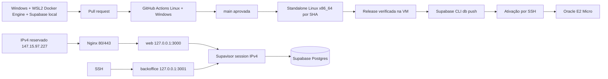

# Infraestrutura, ambientes e deploy

Esta é a fonte canônica da operação técnica. Decisões ficam nos ADRs 014, 019, 020, 021 e 023; resultados
de uma execução pertencem ao check, deployment ou PR que os produziu.

## Contrato vigente

| Componente        | Contrato                                                                                       |
| ----------------- | ---------------------------------------------------------------------------------------------- |
| desenvolvimento   | Windows nativo; Docker Engine oficial em WSL2 dedicado; Supabase local em loopback             |
| produção de dados | Supabase Cloud `oirvvnojgkzdppkdvhej`, `sa-east-1`, sem branches remotas nesta fase            |
| produção web      | Oracle E2 Micro Always Free-eligible x86_64, Ubuntu 24.04, 50 GB, IP reservado `147.15.97.227` |
| origem web        | `https://147.15.97.227`, com indexação bloqueada até o go-live                                 |
| backoffice        | somente `127.0.0.1:3001`; exposição pública adiada                                             |
| entrega           | GitHub Actions, migrations forward-only e release imutável por SHA                             |

Não existe acceptance remoto. Testes destrutivos, seeds e usuários QA ficam exclusivamente no ambiente
local. `main` representa produção e só recebe mudanças pelo [ciclo obrigatório](review-deploy-cycle.md).

## Topologia



Produção não usa Docker, build na VM, registry de imagem, runner self-hosted, agente de polling ou login
OCI em cada merge.

A retirada do antigo agente pull é uma migração administrativa única, não uma camada de compatibilidade
permanente. O host final não conserva suas units, executáveis, usuários, credenciais ou árvore de
release; antes de qualquer mutação, o bootstrap recusa a presença de qualquer path ou identidade dessa
superfície aposentada. Assim, um snapshot antigo ou configuração manual não pode reativar silenciosamente
o segundo mecanismo de deploy.

## Desenvolvimento local

`npm run local:setup` inicia a stack oficial da Supabase CLI, recria o banco e grava três arquivos
ignorados: `.env.local`, `apps/backoffice/.env.local` e `.env.e2e.local`. O login DAL local é exclusivo,
assume `app_dal` e não aceita host diferente de `127.0.0.1`. A mesma execução gera uma chave base64url
de 32 bytes para `BACKOFFICE_RUNTIME_UNLOCK_KEY`, compartilhada somente entre o ambiente privado do
backoffice e o runner E2E; ela nunca é versionada.

O banco local contém somente dados QA descartáveis. Não há firewall customizado: a própria fronteira
Docker é validada como local antes e depois de iniciar a stack. A distro `SetLivreDocker` hospeda
somente o Engine oficial; o CLI Windows usa o contexto `set-livre-wsl` para
`tcp://127.0.0.1:2375`. O wrapper inicia o serviço sob demanda, enquanto os timeouts oficiais de oito
horas da distro e da VM WSL evitam interrupção durante uma jornada de desenvolvimento sem manter tarefa
agendada.
Aplicações e testes continuam nativos no Windows e nunca reutilizam credencial ou dado de produção.
O runner Playwright reutiliza um pool PostgreSQL administrativo e um DAL por processo, com uma conexão
e lease exclusivo por operação. Isso preserva transações no mesmo cliente e impede que conexões locais
descartáveis esgotem o intervalo de portas efêmeras do Windows durante a suíte multibrowser.
Consulte [development.md](development.md).

## CI e proteção de branch

O workflow `.github/workflows/ci.yml` contém cinco definições de job; a matriz Playwright expande uma
delas em seis runners:

1. **Linux quality and release contracts**: gates estáticos, Vitest, reset e pgTAP local, build,
   pacote, `actionlint`, prova dos contratos Nginx/systemd/SSH, ativação, falhas e recuperação do
   instalador, além do smoke standalone Linux x86_64;
2. **Playwright shard N/6**: seis runners Ubuntu simultâneos, cada um com checkout, dependências,
   Supabase local e servidores próprios, cobrindo em conjunto a matriz Playwright completa uma única
   vez;
3. **Quality, local Supabase and browser gates**: agregador protegido que sempre inspeciona os
   resultados anteriores e só termina verde quando o job Linux e toda a matriz Playwright retornam
   exatamente `success`;
4. **Windows native contracts**: contratos TypeScript/Vitest e build/pacote no ambiente Windows;
5. **Deploy production**: em push de `main` ou recuperação manual explicitamente cercada ao SHA atual
   de `main`, sempre depois dos dois contexts protegidos verdes e quando `PRD_DEPLOY_ENABLED=true`.

`workflow_dispatch` permite repetir manualmente os dois gates sem fabricar commit quando o evento do
GitHub não cria uma check suite. Por padrão ele não publica produção. O único opt-in de recuperação
exige selecionar a própria branch `main`, marcar `deploy_production` e informar em `release_sha` o SHA
completo que o evento resolveu como `github.sha`; valor ausente, branch diferente ou SHA arbitrário
reprova a execução antes dos gates e mantém o job de produção omitido. O checkout continua preso a
`github.sha`, passa novamente pelos dois gates e pelo environment `production`, além da flag explícita.

Workflows de pull request não recebem secrets de produção e o checkout remove a credencial Git depois
da clonagem. Cada gate relevante possui step próprio; Actions externas são oficiais e fixadas por SHA.
Quando um shard Playwright falha, o CI preserva por sete dias somente seu relatório, traces, screenshots
e vídeos em um artifact identificado também pelo shard; runs verdes não acumulam evidência redundante.
Os seis shards rodam simultaneamente em VMs descartáveis distintas. Cada runner recria sua própria stack
Supabase e conserva `workers: 1`, portanto nenhuma fixture, porta, banco ou servidor destrutivo é
compartilhado entre shards. `fail-fast: false` deixa os seis chegarem a estado terminal e exporem todas
as falhas da rodada. O job Linux estrutural também roda em paralelo com a matriz; seus orçamentos são 45
minutos para contratos Linux, 30 para cada shard e 5 para o agregador.

O context obrigatório `Quality, local Supabase and browser gates` é esse agregador mínimo e usa
`always()` apenas para observar resultados terminais: `failure`, `cancelled` e `skipped` são rejeitados,
e somente `success` simultâneo de Linux e da matriz o aprova. `Windows native contracts` permanece o
segundo context obrigatório da branch protection. O terceiro context, `Codex review contract`, não é um
job: uma credencial confiável o publica somente depois do ciclo de review limpo descrito em
[review-deploy-cycle.md](review-deploy-cycle.md).

## Release e deploy

`npm run release` exige que os dois `BUILD_ID` sejam o SHA Git completo e cria somente:

```text
.artifacts/release/
├── web/
├── backoffice/
└── release-manifest.json
```

Antes de remover qualquer artifact anterior, o empacotador exige que `.artifacts` e cada componente
existente do destino sejam diretórios físicos sob a raiz física do repositório; symlink ou junction em
qualquer ancestral falha sem tocar seu alvo.
As raízes de entrada (`standalone`, estáticos, `public` e `node_modules`) também precisam ser diretórios
físicos contidos na raiz canônica do checkout. Somente links encontrados depois dessa validação, dentro
das árvores permitidas, podem ser materializados.

No merge, o workflow:

1. usa o project ref literal versionado e valida o contrato fixo antes da primeira escrita cloud;
2. exige uma única host key Ed25519 para o IP de produção e autentica chave privada, host exato e o
   comando SSH forçado antes de qualquer migration; esse preflight atravessa o `sudo` não interativo,
   o entrypoint root instalado e o mesmo lock do deploy. A camada SSH e a privilegiada validam suas
   próprias precondições, e o laboratório prova que recusam raízes, locks de upload ou marcadores de
   bootstrap, recovery ou ativação interrompida sem alterar release ou serviços. Certificado de IP com
   pelo menos 24 horas, SAN, `nginx -t`, serviço ativo e `/robots.txt` pela rota HTTPS pública também
   precisam passar sem desabilitar a validação TLS;
3. quando as roles já existem, exige antes de qualquer migration que os atributos, memberships, grants,
   ownership e read models do banco atualmente implantado passem no readiness do próprio head remoto;
4. prepara os dois ambientes efêmeros e seu SHA-256 combinado, então inspeciona no host uma release
   root-owned do mesmo SHA: quando ela já existe e passa novamente em checksum, manifesto, digest de
   árvore, digest do host e contrato de ambiente corrente, reutiliza exatamente seus bytes; quando está
   ausente, constrói web e backoffice, recusa segredo no artifact, cria duas vezes o tar normalizado e
   exige bytes idênticos;
5. no caminho novo, envia o archive e os dois ambientes pelo comando SSH forçado, valida-os no host e preserva a release
   root-owned completa sem trocar o symlink ou iniciar serviços;
6. somente depois de existir essa release exata e já verificada no destino aplica migrations pendentes com
   `supabase db push --linked`, sem seed, e exige que o maior head remoto seja exatamente o head
   compilado pelo candidato;
7. inicializa a identidade restrita somente quando ela está `NOLOGIN` e sem verificador. Um resultado
   ambíguo abre conexões administrativas novas, força `NOLOGIN`, encerra sessões com espera limitada e
   aceita ausência do verificador apenas se o commit inicial não terminou; nos deploys seguintes
   retoma ou valida a credencial existente sem rotacioná-la ou imprimi-la;
8. ativa somente a release staged já autenticada, sem reupload depois da migration;
9. verifica readiness interno dos dois apps e HTTPS público durante a ativação, e repete o health
   público a partir do runner.

O instalador `ops/deploy-release.sh` valida caminho, ownership, checksum, manifesto, entrypoints,
ambientes, o digest não secreto do par de ambientes, o digest persistido da árvore completa e o digest
da configuração efetivamente instalada no host. Antes de extrair limita tamanho e
interrompe a leitura no primeiro header além das 20.000 entradas permitidas, sem materializar uma lista
não limitada; aceita somente diretórios e arquivos regulares nas três raízes esperadas. Cada
SHA ocupa `/opt/set-livre/releases/<sha>` junto aos ambientes e à identidade do mesmo SHA. O staging
termina antes da primeira migration e a ativação posterior recalcula os bytes da árvore, relê checksum,
manifesto, metadados e digest do host dessa mesma raiz root-owned, sem aceitar novos uploads. O link
`/opt/set-livre/current` só é aceito quando resolve exatamente para essa raiz SHA, nunca para um filho;
só então o instalador interrompe timer, gate, cleanup e ambos os aplicativos, troca o link, exige
sucesso do cleanup inicial da candidata e reinicia os serviços para provar readiness interno e
HTTPS público. Rollback e recovery seguem a mesma ordem: apps parados antes de restaurar o link e
cleanup da release recuperada aprovado antes de reiniciá-los. Falha ao interromper a cadeia impede
a troca do link; cleanup falho não permite iniciar a release correspondente. Um marcador root-only
preserva o alvo anterior até o commit do health; traps restauram
esse alvo em erro, `HUP`, `INT` ou `TERM`. No boot, web e backoffice são units estáticas, sem vínculo
direto com `multi-user.target`; somente `set-livre-application-start.service` pertence ao boot e exige que
`set-livre-release-recovery.service` termine com sucesso; em seguida, o próprio gate inicia
sincronamente a oneshot `set-livre-media-cleanup.service` e somente depois inicia os aplicativos. A
oneshot não declara ordenação de volta para a recovery, pois deploy e recovery também a invocam
sincronamente e essa aresta criaria espera circular. Assim ela sempre lê o symlink já estabilizado pelo
control plane que a chamou. Suas pré-condições de release, ambientes e ausência do blocker principal
usam assertions do systemd; o próprio gate de aplicação também exige ausência das duas fases do
bootstrap. Qualquer ausência, corrupção ou fase residual falha a inicialização dos aplicativos, em vez
de pular silenciosamente o cleanup. A fase durável de recovery bloqueia o timer periódico, mas não a
oneshot controlada. Fora das transições, o timer ativa `set-livre-application-start.service` a cada dez
minutos; o gate sem `RemainAfterExit` executa `cleanup → apps` e volta a inativo. Assim uma falha
transitória do cleanup no boot mantém os apps parados e a próxima ativação do timer repete o gate por
inteiro, sem `OnSuccess`, chamada assíncrona ou aresta circular. Deploy e bootstrap interrompem, nessa
ordem, timer, gate e cleanup antes de trocar estado. Isso restaura o ledger antes de concluir um boot
frio. A mesma recovery unit é
disparada pela path unit quando existe marcador. O lock root-only compartilhado é aberto sem seguir
links, validado pelo descritor e preservado por toda a operação; recovery aguarda por no máximo cinco minutos,
depende de `network-online.target` e `nginx.service` e recebe do systemd uma janela de quatorze minutos,
incluindo espera pelo lock, parada dos serviços, cleanup e tentativas limitadas de health. Ela
pode iniciar os apps internamente para provar health sem depender do gate e, portanto, sem ciclo de
units. Uma fase root-only adicional é publicada antes de remover o blocker do bootstrap e permanece até
o readiness terminal. Se a recuperação recebe `SIGKILL`, seu `ExecStopPost` interrompe os apps e, no
fluxo de bootstrap, também recompõe o blocker. O link só é alterado depois de autenticar blocker/fase,
digest instalado e manifesto
da release; rollback, boot e retry removem o marcador apenas depois de estabilizar os serviços e provar
readiness interno e HTTPS público. Uma falha mantém o marcador para nova tentativa e interrompe os
serviços. Um marcador anterior bloqueia preflight e deploy; somente a recovery unit dedicada o consome.
A recovery unit encerra sem trabalho se o deploy normal já removeu seu próprio marcador. Rollback
incapaz de voltar ao readiness interno e HTTPS público interrompe os serviços. Um SHA existente só pode
ser reutilizado quando checksum, artifact, ambientes, contrato corrente e o digest determinístico
persistido correspondem à árvore instalada completa; alteração de conteúdo, caminho, tipo, owner, grupo ou modo falha antes da
ativação. O workflow consulta essa raiz antes de buildar e, em retry do mesmo SHA, usa o checksum relido
da release já verificada em vez de produzir novos bytes Next. A retenção ocorre antes da ativação e
mantém no máximo quatro releases, incluindo candidata e anterior. Ordem, timestamps, owner e gzip ainda
são normalizados para tornar o archive estável dentro da mesma build, sem tratá-lo como prova de
reprodutibilidade entre builds independentes.
O empacotador percorre o standalone sem preservar referências de filesystem: links simbólicos cujos
alvos permanecem na própria árvore ou no `node_modules` instalado pelo lockfile, além de hard links, são
materializados como arquivos ou diretórios independentes. Links que escapam dessas raízes, ciclos e
objetos especiais falham fechado. O archive também desduplica inodes defensivamente. O instalador
permanece estrito e rejeita links simbólicos, hard links e qualquer tipo de entrada diferente de arquivo
regular ou diretório.
Antes da compactação, o empacotador também recusa `.env` e ocorrências exatas das credenciais de banco
disponíveis ao processo; o artifact parcial é removido em caso de falha.
Cada build Next, bem-sucedido ou não, retira `.next/cache` por rename e remove a árvore física antes de
retornar. Uma limpeza incompleta falha o gate, impedindo que credenciais expandidas permaneçam no
workspace ou sejam alcançadas por uma coleta ampla de artifacts.

Migrations não sofrem rollback automático. Mudanças usam expand/contract em PRs separados: o health
aceita o head compilado de uma release enquanto ele existir no histórico aplicado, preservando a
release anterior durante a ativação, mas o deploy exige que o maior head remoto corresponda exatamente
ao candidato antes de publicar. O gate de PR também recusa `databaseMigrationHead` diferente da
migration mais recente, impedindo que um schema forward-only seja aplicado antes de detectar o contrato
compilado obsoleto. O migration guard compara a árvore candidata com a base aplicada: cada migration de
`main` precisa continuar presente e idêntica em bytes, e toda migration nova precisa ter timestamp
posterior ao maior timestamp dessa base. A topologia intermediária dos commits não altera esse contrato;
conflitos entre branches são resolvidos na árvore final antes do merge. Alterações destrutivas exigem
backup e recuperação comprovada.

## Host Oracle

`ops/bootstrap-host.sh` é idempotente para a VM dedicada e instala apenas:

- Node 24.18 x86_64 baixado sem configuração `curl` ou proxy herdado, verificado pelos
  `SHASUMS256` oficiais, extraído em staging, validado como árvore
  root-only funcional e publicado por rename somente depois da prova integral; o alias canônico
  `/opt/node` também é preparado como link validado, substitui diretório legado por quarentena
  recuperável e só então é publicado; o SHA-256 do binário efetivo fica em marcador protegido e é
  recalculado em todo preflight de deploy;
- Nginx, systemd e OpenSSH; a superfície SSH exige owner/grupo root e ausência de escrita por identidades
  não privilegiadas, recusa qualquer `Match`, include aninhado ou drop-in simbólico, aceita somente o
  include global canônico e então valida por `sshd -T` a política efetiva para usuário comum, deployer e
  root antes do reload, interpretando semanticamente a lista `AllowUsers`; `PermitUserEnvironment`
  permanece desativado e `AcceptEnv` só admite `LANG`/`LC_*`, recusando variáveis de inicialização de
  shell ou loader como `BASH_ENV`; a autorização aceita apenas `.ssh/authorized_keys`, sem comando
  alternativo nem CA de usuários, e exige `ForceCommand none` global para que nada substitua o comando
  restrito da própria chave;
  no runner sem daemon, o laboratório cria e valida `/run/sshd` somente como fixture efêmera e o remove
  ao terminar;
- `iptables-persistent`, Fail2ban, Certbot oficial via Snap e atualizações
  automáticas;
- gate de boot e recovery habilitados; as units dos apps são estáticas, exigem seu entrypoint imutável e
  limitam tentativas de restart para não criar loop em host vazio ou artefato inválido;
- pelo menos 1 GiB de swap para reduzir risco de OOM no shape de 1 GB; somente arquivo regular,
  root-owned, `0600`, sem hard link e já formatado como swap é preservado, e qualquer estado inválido é
  removido sem seguir symlink nem apagar diretório recursivamente antes da substituição atômica;
- usuários sem senha separados `setlivre-web` e `setlivre-backoffice`, com home inexistente e shell de
  nologin, além de `deploy-setlivre` com home e shell estritamente fixados para entrega por chave;
- units, sites Nginx, comando SSH forçado e instalador de release revisados no repositório.

Diretórios e identidades:

```text
/opt/set-livre/releases/<sha>    root:setlivre 0750
  .runtime/web.env               root:setlivre-web 0640
  .runtime/backoffice.env        root:setlivre-backoffice 0640
  .runtime/release.env           root:setlivre 0640
/opt/set-livre/current           symlink para código + ambientes do mesmo SHA
/opt/set-livre/.activation-rollback marcador transitório root:root 0600
/home/deploy-setlivre            root:deploy-setlivre 0750
/home/deploy-setlivre/.ssh       root:deploy-setlivre 0750
/home/deploy-setlivre/.ssh/authorized_keys root:deploy-setlivre 0640
/home/deploy-setlivre/incoming   deploy-setlivre:deploy-setlivre 0700
/home/deploy-setlivre/incoming/.incoming.lock deploy-setlivre 0600
/etc/set-livre/host-config.sha256 root:setlivre 0640
/etc/set-livre/host-config.previous.sha256 root:setlivre 0640, somente durante bootstrap
/etc/set-livre/bootstrap-in-progress.sha256 root:root 0600, somente durante bootstrap
/etc/set-livre/bootstrap-recovery-in-progress.sha256 root:root 0600, até readiness terminal
/etc/set-livre/supabase-root-2021-ca.crt root:root 0644
```

Os processos Node executam com UIDs e arquivos de ambiente separados, sem root, com `NoNewPrivileges`,
devices privados, capabilities vazias, namespaces/realtime bloqueados, filesystem protegido e apenas
AF_UNIX/IPv4/IPv6. O grupo compartilhado `setlivre` concede somente leitura do artifact e do SHA
ativo. O workflow sincroniza em cada release somente as cinco chaves esperadas (`APP_ENV`, URL DAL,
origem do app, URL e publishable key do Supabase); o instalador recusa chave extra, encoding inválido,
projeto/role/host divergente, qualquer chave que não use `sb_publishable_` ou ambiente entre os apps
inconsistente. Antes de escrever qualquer chave, o bootstrap exige nomes, UIDs não root, grupos
primários e suplementares exatos, ausência de membros reversos inesperados, homes, shells e senhas
bloqueadas para as três identidades; uma conta preexistente divergente falha fechada. Home e `.ssh` do
deployer são root-owned, cada diretório gerenciado é aberto com `O_NOFOLLOW` antes de qualquer mudança
de owner ou modo, percorrendo cada componente desde `/`, inclusive `/opt/set-livre`, `releases` e toda a
cadeia `/var/www/set-livre-acme/.well-known/acme-challenge`; sem marcador válido, uma raiz operacional já
existente é recusada. Em retry gerenciado, a cadeia existente também é validada antes de consultar o
rollback ou remover um `current` pendente. Somente `incoming` permanece gravável pelo deployer. Em
seguida, o bootstrap exige
exatamente uma chave pública, decodifica o blob SSH, comprova o algoritmo Ed25519 e os 32 bytes de
material e substitui `authorized_keys` por rename atômico. A chave instalada usa
`authorized_keys command=` e aceita apenas uploads limitados, `inspect <sha>`,
`stage <sha> <checksum>` e `activate <sha> <checksum>`; não abre
shell, SCP genérico ou comando arbitrário. Somente o instalador pode ser executado como root. Ambientes
antigos permanecem protegidos dentro das releases retidas e são removidos pela mesma política de
retenção; uma credencial alterada exige novo SHA, nunca reescrita silenciosa de release.

Uploads usam lock próprio e o diretório `incoming` conserva no máximo o SHA em preparação. Antes de
cada comando, nomes temporários interrompidos e artifacts de outro SHA são removidos somente após
validar nome, arquivo regular, owner e modo; entrada divergente bloqueia o fluxo. Assim, cancelamento
entre upload e deploy não acumula archives de até 256 MiB nem pode apagar caminho arbitrário. Sob o
lock de deploy, o instalador privilegiado valida novamente o diretório e o arquivo de lock, readquire o
lock de upload fechado pelo `sudo` e o mantém enquanto copia os três inputs para arquivos root-only. A
mesma regra remove cópias confiáveis residuais em `/var/tmp` antes de criar outra. Assim, outro upload
não pode substituir archive ou ambiente entre validação e cópia, nem mesmo em retry do mesmo SHA.

Depois de adquirir o lock exclusivo, o instalador remove somente diretórios residuais que correspondem
exatamente a `.staging-<sha>.<sufixo-mktemp>`, são diretórios reais dentro de `releases` e pertencem a
`root`. Isso recupera `SIGKILL` ou reboot entre extração e rename sem aceitar path genérico; nome,
owner ou tipo divergente bloqueia a ativação para inspeção.

Antes de abrir o archive com `tarfile`, uma pré-varredura streaming lê blocos fixos do TAR, limita cada
header PAX/GNU a 64 KiB, limita a metadata acumulada a 8 MiB, rejeita sparse e encerra no máximo de
headers e bytes descompactados. Só então a extração valida as até 20.000 entradas e 512 MiB de conteúdo;
um gzip pequeno não consegue provocar alocação de metadata proporcional ao tamanho declarado.

O manifesto contém o SHA-256 determinístico dos arquivos versionados que definem o host. Antes de
qualquer mutação gerenciada, o bootstrap compara esse digest com o manifesto da release ativa, recalcula
e compara o digest persistido da árvore completa dessa release e publica
atomicamente um marcador `bootstrap-in-progress` root-only. Imediatamente depois, interrompe toda unit
de app carregada e prova que ambas estão inativas antes de inspecionar ou reparar `current`, validar a
release e alterar pacotes ou qualquer superfície gerenciada. Quando existe contrato ativo válido,
preserva sua cópia `host-config.previous` e invalida o digest ativo. As units exigem simultaneamente o
digest ativo e a ausência
de `bootstrap-in-progress`; um reboot durante as mutações não reinicia a release. Depois de validar
integralmente as superfícies estáticas, o bootstrap publica o novo
`/etc/set-livre/host-config.sha256` por rename atômico enquanto ainda mantém o marcador transitório; o
instalador de release rejeita esse estado. Quando a release é compatível, o bootstrap arma primeiro o
marcador de rollback para a própria raiz SHA, persiste a fase de recovery e só então remove o in-progress
que bloqueia as units. A
recuperação existente permanece responsável pela transição até os dois readiness internos e o HTTPS
público passarem. Quando os marcadores coexistem após uma interrupção, ela só libera os serviços se o
blocker ou a fase durável, `host-config.sha256` e o digest do manifesto da release apontada forem
idênticos e tiverem tipo, owner e modo exatos. Essa autenticação termina antes de qualquer troca de
`current`; estado inválido não altera o link ativo. Falha de readiness republica atomicamente o bloqueio de
bootstrap antes de parar os serviços e preserva fase e rollback para retry; estado divergente permanece
intocado e falha fechado. Reboot relê a fase antes do start; `SIGKILL` aciona o selamento do systemd e
estabiliza a mesma release em uma nova tentativa.
Se a publicação da fase falha ou um sinal capturável chega entre o rollback e essa publicação, o cleanup
remove primeiro o rollback ainda não recuperável e somente então o digest instalado; se a fase já existe,
mantém digest/rollback e recompõe o blocker. Assim, nenhum caminho deixa rollback sem a identidade usada
para autenticá-lo.
Sem release compatível, o in-progress permanece até todas as finalizações terminarem; o digest novo é
marcado como estado gerenciado antes de sua remoção terminal. Depois do readiness aprovado, ou da
confirmação de que não há app compatível ativo, o bootstrap desarma primeiro o cleanup capaz de parar
os serviços e somente então consome os marcadores finais. Assim, um sinal ou erro tardio conserva estado
retryable ou mantém os apps já saudáveis, sem reclassificar a árvore preparada como legado.
Somente depois dessa prova o bootstrap desarma o rollback. Se os digests divergirem, o symlink
ativo é retirado sem apagar o diretório imutável e os apps permanecem parados até o deploy do artifact
correto. Se uma release compatível não recuperar readiness interno e público depois do estado terminal,
os serviços param e o symlink é retirado, mas o host válido permanece pronto para receber novamente uma
release aprovada. Se o health falha, o bootstrap republica o in-progress antes de retirar o symlink e o
rollback, mantendo boot e deploy bloqueados até uma reexecução segura. Um `current` pendente, cujo
destino já não existe, é removido pelo bootstrap somente depois de parar e verificar os apps, antes da
validação de release para que uma entrega aprovada possa reparar o host. Se Nginx, systemd, CA,
bootstrap, comando SSH ou instalador mudarem, o
deploy falha antes da ativação até que o agente reaplique o bootstrap pela conta administrativa.
O preflight não confia apenas no marcador: recalcula o mesmo digest sobre os arquivos efetivamente
instalados, verifica o hash do Node, exige que o site Nginx seja byte a byte o template TLS e que seu link
aponte ao destino canônico, e confere cada unit carregada, seu estado `enabled`/`static`, fragmento,
ausência de drop-in e `NeedDaemonReload=no`, tudo antes de qualquer migration forward-only.
Uma reexecução reconhece os caminhos reutilizados `/opt/node-v24.18.0-linux-x64`, `/opt/set-livre` e
`/opt/setlivre` somente quando
ao menos um marcador de estado válido é arquivo regular, root-owned, tem modo exato e contém um único
SHA-256: o ativo/anterior usa `root:setlivre 0640` e o in-progress usa `root:root 0600`. Sem essa prova,
esses caminhos continuam tratados como resíduo da arquitetura retirada e o bootstrap falha fechado.
Ao entrar, o bootstrap abre `/etc/set-livre` sem seguir links e aceita somente o estado saudável
`root:setlivre 0750` ou o estado já bloqueado `root:root 0700`; em host novo, cria diretamente o segundo.
Ele valida os marcadores e superfícies existentes sem alterar o estado saudável, publica primeiro o
`bootstrap-in-progress` e somente então restringe o diretório a `root:root 0700`. Assim, até `SIGKILL`
entre a restrição e a parada dos serviços deixa uma barreira durável que impede restart/reboot com o
CA inacessível. Depois de validar as identidades canônicas, publica o estado final como
`root:setlivre 0750`. O link Nginx de uma instalação gerenciada pode estar ausente ou apontar exatamente
para `/etc/nginx/sites-available/set-livre`; qualquer tipo ou destino diferente falha fechado.
Toda folha gerenciada — CA, chave autorizada, binários de deploy, units, templates/site Nginx, hook de
renovação, sudoers, configuração SSH/Fail2ban, regras persistidas e `fstab` — recusa destino symlink ou
hardlink. O conteúdo com owner/modo final é preparado em
`/etc/set-livre/.managed-file-staging`, diretório `root:root 0700` no mesmo filesystem, e entra no destino
por rename atômico. Um `SIGKILL` pode deixar somente um arquivo inacessível nesse staging privado — nunca
um executável dentro do diretório de hooks — e o retry remove apenas nomes, tipo, owner e modo que
correspondam exatamente à publicação interrompida; resíduo divergente falha fechado. `fstab` aceita
exatamente uma entrada canônica de swap; configuração conflitante bloqueia o bootstrap em vez de ser
duplicada.
Quando a release ativa já carrega o mesmo digest candidato, a reaplicação publica a configuração
estática, arma a recuperação, libera o start controlado e prova o mesmo SHA nos endpoints internos e no
HTTPS público antes de remover o rollback. Falha anterior mantém `bootstrap-in-progress`, remove o
digest candidato e bloqueia boot/deploy até a reexecução. Falha de health rearma esse bloqueio antes de
desativar o symlink; não existe janela em que reboot possa iniciar uma release ainda não validada.

### Rede e SSH

NSG e a cadeia persistente `SETLIVRE_INPUT` expõem somente:

- `22/tcp`: SSH por chave Ed25519, sem senha/root, com bloqueio de tentativas pelo Fail2ban;
- `80/tcp`: ACME e redirecionamento para HTTPS após emissão;
- `443/tcp`: aplicação.

Portas 3000 e 3001 escutam em loopback. O deploy normal usa SSH direto e não depende da sessão OCI de
uma hora. OCI Bastion pode permanecer como acesso emergencial, mas não participa do pipeline.
O IPv4 público é reservado e regional para que DNS, trust SSH e recuperação não dependam do ciclo de
vida da VNIC. A distinção oficial entre endereços efêmeros e reservados está na
[documentação de Public IP Addresses da Oracle](https://docs.oracle.com/en-us/iaas/Content/Network/Tasks/managingpublicIPs.htm).
Uma VM substituta preserva o IP, mas recebe outra host key. Antes de atualizar
`PRD_VM_SSH_HOST_KEY`, o fingerprint Ed25519 é lido pela Console/Serial Console autenticada da OCI e
comparado fora da conexão SSH; `ssh-keyscan` sozinho nunca estabelece confiança. Só depois dessa rotação
o workflow volta a usar `StrictHostKeyChecking=yes`. A sequência operacional completa está em
[`backup-restore.md`](backup-restore.md#recuperação-da-vm).
O bootstrap deriva o ruleset completo a partir do estado Oracle, valida-o antes da aplicação e troca
cada família com uma única transação `iptables-restore`. Snapshot de memória e arquivos persistidos são
restaurados automaticamente se qualquer etapa falhar. A cadeia `InstanceServices` fornecida pela imagem
Oracle precisa permanecer byte a byte equivalente. UFW não é instalado porque sua ativação pode remover
regras necessárias ao boot e aos volumes da instância,
risco registrado pela Oracle em
[Known Issues for Compute](https://docs.oracle.com/en-us/iaas/Content/Compute/known-issues.htm). A
aplicação imediata usa `iptables-restore` após o teste; o comando `netfilter-persistent reload` não é
usado porque a imagem Oracle configura restore sem flush e uma recarga em runtime duplicaria regras.
Timestamps e contadores são removidos do arquivo persistido para que reexecuções idênticas produzam os
mesmos bytes.
O arquivo do Fail2ban é publicado atomicamente, fixa `banaction = nftables`/allports com
`actionstart_on_demand=false` e o restart fica sob responsabilidade do systemd antes do snapshot do
firewall. Assim, até um cold start sem ban anterior cria imediatamente a tabela de proteção. O bootstrap
rejeita override local da ação e prova os comandos efetivos, a tabela/chain `inet f2b-table`, o daemon e a
jail `sshd` antes e depois da transição. O daemon permanece ativo durante a construção e as transações de
`iptables-restore`; não há `stop` manual que possa sobreviver a `SIGKILL` ou OOM nem dependência de um
default externo do pacote.

Nginx substitui `Host`, `X-Forwarded-Host`, `X-Forwarded-Proto` e `X-Forwarded-For`; o último recebe
somente `$remote_addr`, nunca uma cadeia fornecida pelo cliente. Respostas autenticadas não são
cacheadas pelo proxy. A borda transforma o `$request_id` interno em UUIDv4, descarta qualquer
`X-Request-Id` fornecido pelo cliente, encaminha o valor confiável ao app e o publica em toda resposta
que possua headers; até conexões `444` sem resposta conservam o mesmo identificador no log.
`/api/auth/*` e `/api/commands` também recebem um limiter de borda por IP, com
média de uma request por segundo, burst de 30 sem atraso e resposta `429`. Demais rotas usam chave
vazia e não consomem essa zona; os limiters específicos do app continuam sendo a segunda camada. O
diagnóstico por-request do limiter fica abaixo do threshold do error log para não reintroduzir IP ou
target fora do access log redigido. O error log persiste somente severidade `crit`, porque o formato fixo
do Nginx inclui dados brutos em falhas rotineiras de upstream; status, duração e request ID dessas falhas
continuam no access log redigido, e journal/systemd preservam o diagnóstico interno da aplicação.
Hosts desconhecidos são recusados. Nesta fase, somente o Host literal `147.15.97.227` chega ao web; o
backoffice não possui virtual host público. Todas as respostas públicas recebem `X-Robots-Tag` com
`noindex`, e `/robots.txt` bloqueia crawling. A validação estrita de origem usa a mesma origem HTTPS.
Cada bloco `server` substitui o access log `combined` herdado por JSON redigido mantido no repositório.
O registro conserva horário, método, status, bytes, durações e o request ID confiável gerado pela borda,
mas não persiste IP, host, target/query, referer ou user-agent. O IP continua existindo apenas
na memória necessária ao limiter e em `X-Forwarded-For`, não no access log.

## Banco de produção

A VM IPv4 usa o Supavisor em **session mode** na coordenada fixa
`aws-0-sa-east-1.pooler.supabase.com:5432`. O preflight valida host, porta, projeto, banco e identidade,
abre uma sessão administrativa curta e relê as duas roles, seus atributos restritos e os dois sentidos
dos memberships. Se ambas já existem, o readiness versionado do head atualmente implantado precisa
reprovar qualquer drift de grants, ownership, RLS ou superfície DAL antes de qualquer migration. A
ausência simultânea das duas roles é aceita somente com ledger ausente/vazio e sem schemas `audit` ou
`private`, relações, rotinas ou tipos de aplicação não pertencentes a extensões no schema `public`;
estado parcial ou banco não vazio é ambíguo e falha fechado. Uma runtime ainda `NOLOGIN` só dispensa a
autenticação, não o readiness do banco atual.
Quando já possui `LOGIN`, uma conexão real com a URL DAL também precisa assumir `app_dal` e passar
`check_runtime_readiness`. O usuário de conexão segue o formato oficial
`app_runtime_production.<project-ref>`, mas a sessão PostgreSQL efetiva precisa ser
`app_runtime_production` e assumir `app_dal`. A URL conserva `options=-c role=app_dal` como contrato
explícito e defesa para conexões diretas, mas isso não é autoridade na produção: o Supavisor pode não
encaminhar opções arbitrárias do startup packet. A migration append-only configura `role=app_dal`
exatamente para esse login no database `postgres`; uma sessão nova recebe a role pelo PostgreSQL e o
readiness valida setting, `session_user`, role efetiva e membership antes da ativação.
O parser compartilhado aceita somente a coordenada local
`app_runtime_local@127.0.0.1:54322/postgres` sem TLS ou a coordenada de produção acima com usuário e
project ref exatos, `sslmode=verify-full` e uma única opção `role=app_dal`; qualquer outra role, host,
porta, banco ou combinação de parâmetros falha fechado.

O contrato exige `sslmode=verify-full`. `app_runtime_production` tem limite total de dez conexões, sem
inherit, superuser, criação, replicação, bypass RLS, TEMP ou objetos próprios. Sua única ACL direta é
`CONNECT` sem grant option; qualquer outro grant direto bloqueia readiness. A migration cria a role
como `NOLOGIN` sem senha. `scripts/provision-production-role.mjs` distingue três estados: inicializa
senha e `LOGIN` quando não existe verificador, retoma `LOGIN` sem trocar a senha depois de uma
compensação que preservou o verificador e somente valida quando a role já está ativa. `LOGIN` sem
verificador é inválido. Os atributos vêm da view pública `pg_roles`; a conexão administrativa lê de
`pg_authid` somente o booleano de presença do verificador, nunca seu valor. Cada ativação termina
provando uma conexão real que assume `app_dal`.

Da alteração até o readiness, qualquer erro trata o commit como potencialmente aplicado. Uma conexão
administrativa nova impõe somente `NOLOGIN`, sem apagar ou rotacionar a senha, envia primeiro o sinal de
término a todas as sessões runtime e então relê a contagem a cada 250 ms sob um único prazo monotônico
de cinco segundos, compartilhado por qualquer retry. Outra conexão comprova `rolcanlogin=false`,
verificador esperado e zero sessões. Somente um commit inicial ambíguo que não retornou sucesso admite o
estado original sem verificador; uma retomada sempre exige preservação.
Antes de essa compensação encerrar sessões, o cliente que executou o readiness é fechado e retirado do
teardown final, impedindo que a própria conexão seja terminada por outro backend enquanto ainda está
associada a um emissor ativo do driver PostgreSQL.

Nova execução retoma a mesma credencial, evitando invalidar o cache de autenticação do Supavisor. Quando a
role já tem `LOGIN`, o caminho normal é estritamente de validação: secret divergente falha antes da VM
sem alterar a credencial que sustenta a release vigente. Rotação futura exige mudança operacional
própria com duas credenciais/identidades durante a transição, comprovação e retirada da anterior; não
faz parte do deploy normal. Os pools usam `2 + 1 + 2 + 1 = 6`: comandos e readiness do app público,
seguidos pelo DAL e readiness do backoffice. Os quatro slots restantes do limite dez ficam reservados
para verificação de deploy, recuperação e variação operacional. Cada processo conserva seus pools em
um registro global tipado, para que bundles ou recompilações do Next não dupliquem conexões além desse
orçamento.
O `statement_timeout` permanece em dois segundos para comandos e um segundo para readiness. O timeout
da chamada do driver termina um segundo depois em cada caso; essa ordem evita a corrida entre cliente
e servidor, preserva o erro PostgreSQL e oferece margem apenas à fila curta do pool e ao transporte,
sem ampliar o tempo de execução autorizado para SQL.

Antes de definir a senha, o provisionador exige a fronteira gerenciada aprovada pela baseline. `pg_net`
fica desabilitado; qualquer `USAGE/CREATE` efetivo de `app_dal` em schema não sistêmico diferente de
`private` — inclusive herdado por `PUBLIC` — ou `CREATE/TEMP` direto no database por DAL/login de
produção bloqueia deploy e readiness antes de habilitar a senha. O schema `private` e todas as suas
rotinas devem permanecer sob o owner canônico `postgres`; qualquer reassignment também falha fechado.
A membership
reversa aceita somente a administração automática de `postgres`, com `SET/INHERIT` falsos; qualquer
outro membro de `app_runtime_production` também bloqueia o fluxo. Os catálogos
`pg_roles`, `pg_user` e `pg_db_role_setting` pertencem ao `supabase_admin` do
serviço, identidade que o `postgres` do projeto não pode assumir. O bootstrap local preserva para
`supabase_storage_admin` somente a leitura de `pg_roles` necessária às migrations oficiais do Storage,
sem reabrir esses catálogos às roles da aplicação. Como controle compensatório explícito do ADR-019,
quando a ACL gerenciada conserva leitura herdada o banco precisa ter zero setting de role/database cujo
nome denote secret, password, token, credential ou key; exigir simultaneamente a revogação gerenciada
tornaria o contrato inexequível pela role do projeto. A role de produção não grava o antigo GUC vazio.
No local, onde o bootstrap usa o superuser próprio da stack, os três catálogos continuam integralmente
negados à DAL.

A CA pública oficial do Supabase fica versionada em
`ops/certificates/supabase-root-2021-ca.crt`. CI e serviços Node a adicionam à cadeia confiável por
`NODE_EXTRA_CA_CERTS`, mantendo validação de CA e hostname. O bootstrap instala a mesma cópia em
`/etc/set-livre/supabase-root-2021-ca.crt`. Seu SHA-256 é
`807025AD50D4ED219D2C9C7D299C004F824EB00CF7F65AFEF607D07B72E6CAFA` e a validade termina em
2031-04-26; substituição exige obter a nova CA no dashboard, conferir emissor/fingerprint, testar a
conexão real e trocar repositório e host no mesmo release.

O deploy aplica o schema do backoffice, mas nunca escolhe silenciosamente uma pessoa como primeiro
admin. Depois que o responsável indicar uma conta ativa com perfil concluído, o operador PostgreSQL
autorizado chama uma única vez
`private.bootstrap_first_platform_admin(p_user_id => ..., p_request_id => ..., p_idempotency_key => ...)`
e comprova `platform_roles` + `audit.events`; `insert` direto é proibido. Enquanto não houver host de
go-live, o runtime usa `NEXT_PUBLIC_APP_URL=http://127.0.0.1:3001` e o acesso humano abre
`ssh -N -L 127.0.0.1:3001:127.0.0.1:3001 ubuntu@147.15.97.227`, então navega para
`http://127.0.0.1:3001`. O processo remoto continua em loopback, sem virtual host Nginx; `Host` e
`Origin` precisam coincidir exatamente. Os headers `x-forwarded-host` e `x-forwarded-proto` que o
próprio Next normaliza precisam corresponder exatamente a `127.0.0.1:3001` e `http`; qualquer valor
divergente é recusado.

Cada aplicação recebe somente seu segredo necessário. O EnvironmentFile do backoffice contém
`BACKOFFICE_RUNTIME_UNLOCK_KEY`, uma chave base64url de 43 caracteres mantida no environment protegido
`production`. O web contém `SUPABASE_SECRET_KEY`, recuperada e mascarada de forma efêmera pela
Management API durante o job confiável, para assinar paths já autorizados e operar o Storage sem dar
grants ao browser. O workflow valida formato/quebras de linha, transporta os arquivos separados do
artifact e o instalador publica cada um como `root:<grupo-da-aplicação> 0640`; segredo de uma aplicação
é recusado no arquivo da outra. A chave do backoffice vira cookie HttpOnly assinado de cinco minutos;
os candidatos efêmeros do contrato de host reproduzem exatamente esse conjunto obrigatório de chaves,
para que o laboratório Linux valide o mesmo envelope aceito em produção.
Nenhum dos valores entra em bundle, release, log ou browser storage. O preflight
`set-livre-deploy-ready-v11` distingue hosts que já validam esse contrato dos instaladores anteriores
antes de qualquer upload ou migration.

## HTTPS por IP e DNS adiado

O domínio permanece sem apontamento nesta fase por decisão explícita do responsável. A origem canônica
temporária é o IPv4 reservado em HTTPS. Let's Encrypt oferece certificados de IP de curta duração, e o
Certbot passou a suportar emissão por webroot para IP a partir da versão 5.4. O bootstrap remove a
distribuição antiga do Ubuntu, instala a versão oficial estável via Snap, exige no mínimo 5.4, prepara o
webroot ACME abrindo cada componente com `O_NOFOLLOW` e configura o Nginx para recusar também
arquivos-folha symlink dentro dessa raiz. Como essa recusa nativa inclui request e IP em severidade
`crit`, a localização ACME descarta seu error log não redigível; status e request ID continuam no access
log redigido. O timer de renovação permanece habilitado. Referências oficiais:
[disponibilidade geral de certificados de IP](https://letsencrypt.org/2026/01/15/6day-and-ip-general-availability.html)
e [suporte no Certbot 5.4](https://letsencrypt.org/2026/03/11/shorter-certs-certbot).

Emissão e renovação do certificado exigem comprovar SAN, validade e confiança pública sem desabilitar
a verificação TLS; o bootstrap rejeita certificado com menos de 24 horas restantes e a VM mantém o
timer de renovação ativo. O Nginx apresenta o certificado no handshake padrão porque clientes que
acessam uma URL por IP podem omitir SNI, mas somente o `Host` literal canônico alcança a aplicação. A
evidência de cada execução pertence ao deployment ou PR correspondente.

Enquanto `/etc/letsencrypt/live/147.15.97.227` não existe, o template HTTP permite somente o desafio
ACME e encerra qualquer outra conexão; a aplicação não é servida em texto claro. Depois da primeira
emissão, reexecutar o bootstrap valida prazo e SAN de IP com OpenSSL, ativa o template TLS e redireciona
HTTP. A flag de deploy só é habilitada quando
certificado, credenciais, gates e review estiverem prontos, imediatamente antes do merge aprovado. O
readiness HTTPS do SHA recém-publicado comprova então a conclusão da entrega. O timer
`snap.certbot.renew.timer` e um deploy hook versionado validam e recarregam Nginx em cada renovação.

DNS, certificado por nomes e exposição do backoffice serão uma mudança própria de go-live. Os registros
planejados permanecem em `configuration-steps.md`, mas não devem ser criados agora.

## Configuração do GitHub

Coordenadas públicas versionadas no workflow:

- project ref e URL do Supabase de produção;
- IPv4/URL pública e origem futura do backoffice.

Variáveis não secretas do repositório:

- `PRD_DEPLOY_ENABLED`;
- `PRD_SUPABASE_PUBLISHABLE_KEY`;
- `PRD_VM_SSH_HOST_KEY`.

Secrets do environment `production`:

- `SUPABASE_ACCESS_TOKEN`;
- `SUPABASE_DB_PASSWORD`;
- `BACKOFFICE_RUNTIME_UNLOCK_KEY`;
- `PRD_DATABASE_URL_APP_DAL`;
- `VM_SSH_PRIVATE_KEY`.

Depois do `db push`, o workflow executa o seed declarativo de buckets e exige `studio-media` privado,
limite exato de 15 MiB e apenas JPEG/PNG/WebP/AVIF. Em seguida publica uma Edge Function imutável
`media-cleanup-<SHA>`; ausência ou drift do bucket interrompe a entrega antes de habilitar a aplicação.
A fonte canônica dessa Function é TypeScript estrito (`index.ts` e `cleanup-core.ts`). O Deno 2.9.5
fica fixado no lockfile npm e o `npm run typecheck` executa `deno check` diretamente nesse grafo em
Linux e Windows; assim o CI preserva a política que recusa Actions externas e copia o diretório sem
renomear ou trocar extensões antes do deploy.

O cleanup de mídia não adiciona segredo ao GitHub. No começo do job, o workflow usa o
`SUPABASE_ACCESS_TOKEN` já protegido para ler pela Management API exatamente a secret key moderna
`default`, mascara-a e grava-a em arquivo efêmero `0600`; ela alimenta o preflight, o EnvironmentFile
web e o canário, e é truncada/removida em `always()`. Depois das migrations e da publicação da Function
candidata, `npm run production:media-cleanup` cria objetos canário reais, invoca a candidata diretamente
por HTTPS com `apikey` — sem duplicar a secret key moderna em `Authorization` —, exige remoção de ambos
pela Storage API e comprova cada ausência somente por `404/NoSuchKey`, além de conferir a execução terminal vinculada
ao slug no ledger durável. A retenção preserva a candidata e a Function correspondente à release ainda
ativa, identificada pelo health público de liveness, antes de reduzir o conjunto a quatro versões
imutáveis. Resposta negada, contrato ambíguo, chave legada, ACL excedente, timeout, contagem que não
fecha ou cleanup com falha interrompe o deploy sem imprimir credenciais. Uma única Function mutável
legada `media-cleanup` é aposentada somente depois desse canário; cardinalidade ou estado ambíguo
bloqueia a entrega.

Um advisory lock de sessão impede dois configuradores de manipular o canário simultaneamente. Antes do
novo probe, checkpoints `prepared` ou `queued` abandonados há 30 minutos são removidos pela Storage API,
com ausência estrita comprovada para os dois paths, e só depois terminalizados como `probe_abandoned`.
Queda entre remoção e atualização do banco deixa o mesmo checkpoint repetível; erro `400`, `404` com
outro código ou resposta ambígua bloqueia a entrega e não encerra o probe.

O ledger também é autorrecuperável: um run interrompido permanece replayable pelo mesmo UUID, mas,
depois de 30 minutos, a primeira execução com outra identidade o fecha como
`cleanup_run_abandoned`. O replay relê o lote original pelo ledger: resultados já persistidos entram
nas contagens sem repetir Storage ou conclusão de item, e somente os membros pendentes ainda pertencentes
ao token recebem paths, após renovar a lease sob lock de linha e revalidar a identidade. Isso impede
takeover enquanto o replay remove objetos, sem aumentar tentativas ou reescrever o histórico.
Mesmo com todos os itens concluídos, o mesmo run não reclama um novo lote.
Falha histórica permanece falha; lease transferida a outro run mantém o replay fail-closed, sem tocar
objetos alheios, até a recuperação por abandono. Cada claim registra antes um item imutável no ledger
do run; o fechamento
deriva esse conjunto histórico, marca como failed qualquer item ainda pendente e mantém sempre
`claimed = deleted + failed`. Claims e completion tokens em mídia e probes são apenas o estado
operacional atual. O claim seguinte pode reassumir leases vencidos sem apagar o pertencimento anterior,
e o sucesso posterior é a única forma de restaurar readiness. A ausência de qualquer sucesso terminal
nos últimos 30 minutos também degrada readiness, cobrindo falhas que acontecem antes de o worker
conseguir abrir o ledger. A
ativação normal, a recuperação de uma ativação interrompida, o rollback e o bootstrap com release
compatível executam a oneshot do slug da release ativa antes dos health checks internos e público; o
timer de dez minutos só volta depois dessa prova. No recovery, a fase durável do bootstrap é removida
antes de iniciar o timer, e o rollback só é consumido depois de comprovar que o timer ficou ativo. Se a
oneshot falhar durante um bootstrap compatível, o symlink da release, o blocker autenticado e os
marcadores de recovery permanecem íntegros para nova tentativa, com os serviços parados. Não existe
edição manual do banco como procedimento operacional.

Cada invocação da Function reclama no máximo dois itens sequenciais. A leitura do corpo de entrada
tem teto de 256 bytes e 5s; cada remoção Storage tem 10s, e cada RPC tem 5s, incluindo consumo integral
do corpo da resposta, limitado a 64 KiB. Abertura, claim, conclusão de item e fechamento admitem no
máximo uma segunda tentativa com os mesmos parâmetros e identidade, dentro desses prazos.
O claim serializado no banco relê a reserva após
perda de resposta; se as duas tentativas forem inconclusivas, o worker não sela contagens inventadas
e responde erro sem totais, preservando o run para replay ou recuperação por abandono.
Se ambas as respostas de conclusão de algum item se perderem, uma única releitura do lote original
confere identidade, cardinalidade e resultados terminais persistidos, sem repetir Storage. Resultado
pendente, membro ausente/duplicado/trocado ou releitura indisponível deixa o run inconclusivo e
replayable, com erro sem totais; não transforma incerteza em `failed`. O mesmo vale para uma abertura
cuja segunda resposta permanece inconclusiva. Um replay de abertura já terminal reproduz o resultado
sem reclamar outro lote. Se as duas respostas de fechamento se perderem, a RPC de abertura existente
relê uma única vez o mesmo UUID/slug: somente estado terminal com status, contagens e código de erro
exatamente iguais confirma o resultado. Falha persistida continua falha; resposta running, divergente
ou indisponível nunca vira sucesso.
O orçamento inclui 5s de entrada, duas aberturas e dois claims de 5s, mais dois itens de até 20s
(remoção de 10s e duas confirmações de 5s), totalizando 65s. A releitura de itens dispõe de até 5s:
o I/O de trabalho soma 70s, com 20s de margem até seu limite de 90s. Fechamento, replay e releitura
terminal usam até 15s adicionais: 85s de I/O total, com 15s de margem até o envelope de 100s para
despacho, parsing e processamento. O teste de orçamento inclui overhead fora do I/O; uma suspensão
arbitrariamente longa ainda falha fechada, não amplia o limite.
Desconexão cancela novos claims e remoções, mas não cancela as confirmações idempotentes de item:
elas precisam reconciliar um commit cuja resposta se perdeu antes de derivar as contagens do run.
Continuam sujeitas ao deadline de RPC e ao orçamento de trabalho; não há repetição da remoção física.
Aos 90s desde a entrada da Function, nenhum trabalho adicional é iniciado; o fechamento do
run e sua releitura terminal têm deadline próprio de 5s por chamada dentro da janela até 100s,
inclusive se o chamador desconectar. A abertura inicial continua cancelável; somente a releitura após
iniciar o fechamento pertence à finalização. Desconexão que impeça a releitura dos itens ou
esgotamento do orçamento que impeça confirmar o ledger preserva
o resultado inconclusivo, sem selar contagens estimadas.
Falhas comprovadas continuam contabilizadas e o resultado só é saudável depois da confirmação
do ledger. Indisponibilidade ou resposta ambígua do próprio ledger permanece fail-closed e usa a
recuperação de runs abandonados descrita acima, sem fabricar confirmação.

Invocador da release e canário aguardam no máximo 110s, incluindo o JSON da resposta; a oneshot de
cleanup tem `TimeoutStartSec=120s` e `TimeoutStopSec=10s`. Esses limites preservam margem abaixo dos
[150s mínimos de wall clock e idle timeout do Supabase](https://supabase.com/docs/guides/functions/limits)
e da lease de claim de 15 minutos. O configurador mantém 15s para as demais chamadas HTTP e para
Storage, também incluindo o corpo. O lote menor preserva tempo de finalização sem paralelizar mutações
ou introduzir scheduler adicional; o timer continua com intervalo de dez minutos.
O gate `set-livre-application-start.service` permanece sem timeout próprio: para `Type=oneshot`, o
[systemd desabilita o timeout de startup por padrão](https://github.com/systemd/systemd/blob/v255/man/systemd.service.xml#L529-L537),
sem herdar os 90s usuais do manager. A oneshot de cleanup e a recovery conservam seus limites explícitos.

O teto inicial é de 12 mídias por hora (24 objetos, pois cada item remove original e prévia).
Uma galeria máxima de 20 fotos exige dez ciclos: até 100 minutos mais a duração da última execução
depois da elegibilidade, sem outras entradas ou falhas. Esse limite privilegia o fechamento seguro de
um lote na baseline de baixo volume, não promete esvaziar a fila numa única invocação. Readiness mede
sucesso terminal recente e runs falhos/travados, não exige fila vazia; portanto a remoção de uma galeria
não impede novos ciclos nem a saúde entre lotes. O claim ordena por elegibilidade e ID. Antes de admitir
volume sustentado acima de 12 mídias elegíveis/h, é necessário medir entradas, idade do backlog e tempo
de drenagem e rever capacidade; aumentar apenas o timeout não resolve saturação.

O publishable key e a host key SSH são públicos por natureza. Antes de builds e migrations, o preflight
recusa caracteres de controle, espaço, aspas ou barra invertida na URL DAL bruta, antes de normalizar a
URL ou abrir qualquer conexão; esses caracteres precisam estar percent-encoded. O instalador repete o
contrato antes de aceitar os arquivos como `EnvironmentFile` do systemd. O preflight consulta
`GET /auth/v1/settings` no endpoint HTTPS do project ref versionado, envia a chave somente no
header `apikey`, recusa redirect, timeout, resposta diferente de 200 ou JSON inválido e não registra a
chave. Em seguida, a sessão administrativa relê as duas roles e seus memberships. Roles ausentes só são
aceitas quando o ledger de migrations ainda não existe ou está comprovadamente vazio; qualquer histórico
com roles ausentes é drift e bloqueia o deploy. Quando as roles existem, a sessão descobre o maior head
remoto e exige que o `check_readiness` já implantado aprove exatamente esse head.
Se a runtime estiver ativa, uma conexão separada precisa autenticar, assumir `app_dal` e passar no
`check_runtime_readiness`. Senha obsoleta, privilégio ou grant excedente, identidade ambígua ou
indisponibilidade bloqueia o workflow antes de alterar o schema. A mesma fronteira exige o HTTPS
público operacional, e build, scan, archive determinístico, ambientes e staging validado na VM precisam
terminar antes do primeiro `db push`. O instalador da VM também
aceita exclusivamente o formato moderno `sb_publishable_` no campo público; `sb_secret_`, JWT legado
`service_role` e qualquer JWT genérico são recusados nessa posição antes de alcançar bundle ou
artifact. A fronteira server-only do web aceita `sb_secret_` em produção e o JWT `service_role`
somente no runtime local/teste gerado pelo CLI. Senhas, access token, URL DAL e chave SSH privada
nunca entram em logs, artifacts ou documentação.

## Operação e capacidade

Comandos úteis no host:

```bash
sudo systemctl status set-livre-web set-livre-backoffice nginx
sudo journalctl -u set-livre-web -u set-livre-backoffice -n 100 --no-pager
curl --disable --noproxy '*' --fail http://127.0.0.1:3000/api/health/ready
curl --disable --noproxy '*' --fail http://127.0.0.1:3001/api/health/ready
```

Disco, memória, OOM, conexões e latência devem ser medidos. Migração de shape ou arquitetura só é
aberta quando a E2 Micro apresentar pressão recorrente, não por antecipação. A VM única é um ponto de
falha aceito antes do go-live oficial; backup/restore e alertas permanecem gates desse go-live.
