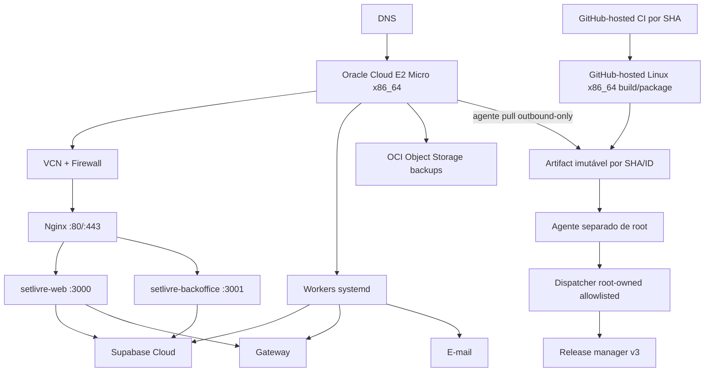

# Infraestrutura, ambientes e deploy

## 1. Topologia



## 2. Ambientes

### Local

- workstation Windows 11 nativa, sem WSL;
- Node `24.18.0`/npm `11.19.0` e Supabase CLI fixada no workspace;
- Docker Desktop `4.86` saudável com containers Linux pelo backend Hyper-V, contexto `desktop-linux`, endpoint `npipe:////./pipe/dockerDesktopLinuxEngine` e `OSType=linux`;
- Long Paths, Hyper-V e SVM habilitados; o reboot de `2026-08-17 22:05:28` terminou com `VirtualizationFirmwareEnabled=True`;
- no Windows, o Docker Desktop usa o comportamento oficial `Localhost only`. Antes de iniciar, o wrapper abre e revalida por descritor o `settings-store.json` físico do perfil e exige `PortBindingBehavior=local-only-port-binding`; depois do start, compara a matriz TCP exata de container/porta interna/porta host e aceita somente `127.0.0.1` literal ou a representação local-only `127.0.0.1` + `::`, recusando wildcard IPv4, UDP, troca, extra, ausência ou duplicação. Os listeners reais ficaram apenas em `127.0.0.1` e conexões às interfaces não-loopback falharam. A antiga regra customizada do firewall foi aposentada; a cadeia local limpa possui 16 migrations e o pgTAP passou em 4 arquivos/361 testes. Linux e CI preservam `127.0.0.1` literal;
- browsers Chromium, Firefox e WebKit do Playwright já instalados no Windows;
- o catálogo documental atual contém 200 cenários. No snapshot Windows atual, 991 unitários passaram com 27 skips condicionais de plataforma, docs:check fechou 34/200/23, o banco passou em 361/361, a matriz Playwright integral em 114/114 por 17 specs/16 projetos e os builds standalone web/backoffice em 26 + 4 rotas. CI hospedado, release Linux x86_64 e deploy conservam gates próprios;
- bootstrap PostgreSQL via `pg` do workspace, sem depender de `psql` global;
- arquivos de ambiente protegidos por owner/DACL e recusa de reparse point;
- processos Next persistentes no Windows nascem suspensos e entram no Job Object do ADR-023 antes de
  executar; saída natural da raiz ou queda abrupta do supervisor eliminam todos os descendentes sem
  `taskkill` ou enumeração de PID;
- app público e backoffice;
- adapter local determinístico quando `APP_ENV=local | test`, sem sandbox remoto;
- e-mail sink;
- único alvo de E2E destrutivo.

### Acceptance

- projeto Supabase separado;
- VM/serviço ativado sob demanda ou namespace isolado;
- provider sandbox somente como topologia alvo após revisão do ADR-018/PEND-004;
- dados sintéticos;
- não manter ocioso sem necessidade.

### Production

- Supabase dedicado;
- VM persistente;
- provider live somente como topologia alvo após contrato e integração aprovados;
- e-mail live;
- domínio/TLS;
- backups;
- alertas.

Credenciais nunca são compartilhadas.

No código implementado nesta etapa, `recipientOnboardingCapability` é derivada server-side por request. `APP_ENV=local | test` produz `local_adapter`; `development | production`, valor ausente ou inválido produzem `unavailable`. Nesses runtimes, recebimentos permanece somente para consulta e start/refresh falham com `503 PAYMENT_PROVIDER_UNAVAILABLE` antes de `prepare`. A tabela acima descreve a topologia final desejada para Acceptance/Production; não afirma sandbox ou provider live já integrados.

A ativação possui capability própria e não é readiness de infraestrutura. Contrato `approved` produz `ownerActivationCapability=available`; `local_fixture` fica disponível somente em `local | test` e consultivo em `development | production`, ambiente ausente ou inválido. Nesses casos, a leitura completa permanece acessível, mas `owner.activate` retorna `503 SERVICE_UNAVAILABLE` antes da escrita. Não há nova variável, migration, serviço externo ou dependência de `/ready`; PEND-006 continua sendo o bloqueio do conteúdo jurídico aprovado.

## 3. Oracle Cloud

### 3.1 Shape

Contrato atual: `VM.Standard.E2.1.Micro` x86_64 elegível ao Always Free, shape fixo em 1 OCPU e aproximadamente 1 GB de RAM. Não existe fallback para shape pago ou maior sem nova decisão humana explícita e evidência de custo.

Sistema: Ubuntu 24.04 x86_64.

O discovery inicial comprovou `sa-saopaulo-1` como home region e uma AD; as tentativas A1/ARM64 daquela fase histórica retornaram `OUT_OF_HOST_CAPACITY`. Após aprovação humana registrada no ADR-021, uma instância diagnóstica `set-livre-production` foi comprovada `RUNNING` em `2026-08-18` com `VM.Standard.E2.1.Micro`, Ubuntu 24.04 x86_64, boot 50 GB e IMDSv2-only. O SSH administrativo por chave foi confirmado. Ao revelar uma falha real no bootstrap anterior, a instância e seu boot volume foram removidos para não conservar host parcialmente configurado. Na última evidência OCI preservada (`2026-08-19T09:45:42Z`), não havia VM Set Livre ativa e o Plan E2 encerrou fail-closed com `OUT_OF_HOST_CAPACITY`. A tenancy admite duas E2 Micro Always Free e outra existe fora do projeto; a posição Set Livre estava liberada nessa evidência, mas sem capacidade física. Isso não comprova hardening, runtime ou deploy.

### 3.2 Disco

- boot volume alvo de 50 GB, com orçamento e monitoramento para releases, logs e runtime;
- aplicação não guarda mídia canônica;
- journald com limite;
- releases antigas limpas após retenção;
- alerta a 70/85/95%.

### 3.3 Rede

Expor:

- 80/TCP para redirecionamento/certificado;
- 443/TCP;
- 22/TCP somente de IP/VPN administrativa.

Portas 3000/3001/worker somente loopback. Backoffice pode usar subdomínio com allowlist/VPN.

A rede comprovada do Set Livre usa VCN `10.20.0.0/16`, subnet regional pública `10.20.1.0/24`, internet gateway, route table, security list sem ingress e NSG com 80/443 públicos, ICMP PMTU e 22/TCP somente do `/32` administrativo. Recursos de outros projetos não foram reutilizados. DNS e TLS ainda não estão comprovados.

Na imagem Ubuntu da OCI, o firewall do host usa `iptables`/`netfilter-persistent`, não UFW. O
bootstrap captura e compara as regras essenciais Oracle de iSCSI antes e depois dos pacotes e da
configuração, não executa flush e insere uma cadeia `SETLIVRE_INPUT` dedicada antes de persistir o
resultado. Qualquer perda ou alteração dessas regras aborta o bootstrap. A cadeia permite somente
loopback, conexões estabelecidas, DHCP reply, ICMP PMTU, SSH do `/32` administrativo e 80/443; o
restante termina em `DROP`. NSG e firewall do host são camadas independentes.

## 4. Usuários e diretórios

```text
/opt/setlivre/
├── releases/<sha>/
│   ├── web/
│   ├── backoffice/
│   ├── workers/
│   ├── runtime/          # env root:setlivre 0640, instalado fora do artifact
│   └── RELEASE.md
├── current -> releases/<sha>
├── previous -> releases/<sha>
└── shared/runtime/
```

O usuário `setlivre`, sem login ou sudo, executa os serviços. O usuário `setlivre-deployer`, também sem login interativo, mantém somente o workdir/staging privado do agente pull e pode chamar via `sudo -n` um único dispatcher root-owned allowlisted. O grupo efetivo `setlivre-deployer` precisa conter exatamente esse principal, contando GID primário e memberships suplementares; `verify` analisa `sudo -ll` e aceita exatamente uma entrada com `RunAsUsers: root`, `!authenticate`, sem `setenv` e único comando `/usr/local/sbin/setlivre-deploy-dispatch`. Ele não recebe sudo genérico, não chama o release manager diretamente e não administra os serviços. SSH permanece separado, para operação humana a partir do CIDR administrativo `/32`.

O bootstrap e o agente pull são duas operações administrativas distintas. Primeiro, na VM Ubuntu 24.04 x86_64, o host recebe somente o CIDR administrativo, a fonte física revisada do manager e o SHA-256 calculado antes da elevação:

```bash
manager_source="$(realpath scripts/production-release-manager.sh)"
manager_sha256="$(sha256sum -- "$manager_source" | cut -d' ' -f1)"
sudo bash scripts/bootstrap-oracle-host.sh \
  "$SET_LIVRE_ADMIN_CIDR" \
  "$manager_source" \
  "$manager_sha256"
```

A assinatura é exatamente `<admin-cidr-/32> <release-manager-source> <release-manager-sha256>`; não existe argumento de public key, usuário ou SSH de deploy. O bootstrap congela a fonte em staging root-owned e valida o hash antes de atualizar pacotes. Depois, `scripts/configure-production-deployer.sh install <agent> <agent-sha256> <smoke> <smoke-sha256>` instala fontes físicas verificadas, dispatcher, sudoers, service/timer e estado de instalação; `verify` comprova owners, modos, hashes, grupo exclusivo, listagem sudo exata e protocolo v3. Atualização posterior do manager usa uma operação administrativa própria e transacional: copia fonte e hash revisados para preparação root-owned, valida versão/hash, troca atomicamente, revalida e restaura o binário anterior se qualquer etapa falhar. O agente e o artifact nunca atualizam o manager. A configuração operacional não secreta fica em `/etc/setlivre-deployer/production.env`, `root:setlivre-deployer` modo `0640`; esse arquivo exige `GITHUB_REPOSITORY_ID=1328339374`, os IDs positivos e distintos dos workflows registrados em `.github/workflows/ci.yaml` e `.github/workflows/prd-deploy.yaml`, `PRD_SUPABASE_PROJECT_REF` no formato `^[a-z0-9]{20}$`, `PRD_SUPABASE_URL` exatamente igual a `https://<ref>.supabase.co` e `SUPABASE_SERVER_CA_SHA256` igual ao hash do certificado oficial. Tokens, senhas, URL DAL e o Server root certificate ficam nos cinco arquivos exatos de `/etc/setlivre-deployer/credentials`, diretório `root:root`/`0700`, cada arquivo físico `root:root`/`0600`; a unit os entrega somente por `systemd LoadCredential`. Os contratos de autorização são gerados no artifact assinado, nunca provisionados como credenciais externas. `configuration-seteps.md` contém a consulta canônica por path e o inventário privado. A sandbox systemd do poller admite escrita somente em `/var/lib/setlivre-deployer/.setlivre`, `/opt/setlivre` e `/run/lock`; `/run` inteiro não é autorizado.

## 5. Build

- Next `output: "standalone"`;
- builds de desenvolvimento e preview suportados em Windows 11 nativo;
- CI release em Linux x86_64;
- `npm ci`;
- gates;
- build público/backoffice/workers;
- copiar `.next/standalone`, `.next/static`, `public`;
- manifest com SHA, Node, lock hash e migration head;
- tar comprimido;
- checksum;
- artifact assinado/protegido quando disponível.

Não usar GHCR.

No gerador canônico Linux, `node scripts/release-manifest.mjs` recompila um checkout limpo com ambientes isolados por app e `BUILD_ID` igual ao SHA, empacota os dois entrypoints com static/public, migrations e lockfile, recusa raiz de artefatos simbólica, montada ou fora do repositório, configuração local, secret incorporado, ferramenta administrativa e link externo, e revalida a árvore completa após o smoke. O comando é Linux-only e deve rodar no Ubuntu de CI/release, não na workstation Windows. A CLI Supabase não viaja no artifact: o bootstrap baixa a release oficial `2.113.0` para Linux amd64, fixa hashes do archive e dos dois binários, valida ELF x86_64 e instala a ferramenta root-owned em `/usr/local/libexec/setlivre-host-tools/2.113.0`; agente e release não possuem autoridade para substituí-la. Antes de qualquer `chmod`, lock ou build, o gerador consulta o `mountinfo` do próprio namespace; toda árvore antiga ou candidata passa por inspeção física completa, recusa mount na raiz ou abaixo, é retirada por rename atômico e só então removida após nova comprovação de identidade, forma e mounts. Assim, bind mounts e volumes esquecidos não são atravessados por limpeza recursiva. A entrada direta deriva a versão npm do manifesto da instalação adjacente ao Node atual, validada contra `packageManager`/`devEngines` antes do primeiro build, sem `npm.cmd`, shell ou resolução por `PATH`. Um lock advisory de kernel, mantido por descritor com `util-linux flock`, serializa toda a geração por checkout antes de qualquer build ou temporário compartilhado e é liberado automaticamente ao encerrar o processo. Cada `.env.local` de release é obrigatório, físico, exclusivo e `0600`; o script o abre sem seguir links, mantém o descritor até terminar a leitura e revalida identidade e modo antes de interpretar o runtime local exato. O readiness empacotado usa somente a URL DAL desse arquivo, validada para o host IPv4 escrito literalmente como `127.0.0.1` e a porta Supabase local, sem aceitar alias, representação alternativa ou override exportado pelo host. Os handlers de interrupção são instalados antes do primeiro spawn; em POSIX, `SIGHUP` encerra ambos os PGIDs detached, elimina descendentes remanescentes e preserva código `129`. O GNU tar usa ordem, ownership, timestamp e modos determinísticos (`0755` para diretórios/executáveis e `0644` para os demais arquivos, sempre removendo `setuid`, `setgid` e `sticky`), é reextraído e comparado à árvore manifestada; um SHA existente nunca é sobrescrito por bytes divergentes. O artefato registra `platform`/`arch`; a release de produção só é apresentada como compatível depois de validar Linux x86_64 no fluxo de PEND-003.

Nenhuma release do branch atual foi gerada ou publicada. A cadeia limpa contém 16 migrations, com
predecessor `20260815000100` e head `20260819000100`; o artefato Linux x86_64 do SHA final continua um
gate obrigatório. Fotografias de builds, smokes, PRs ou releases de features anteriores não comprovam
esta infraestrutura e não substituem os gates atuais.

## 6. systemd

Serviços:

- `setlivre-web.service`;
- `setlivre-backoffice.service`;
- `setlivre-email-worker.service`;
- timers para expiração/reconciliação/payout/backup, ou workers persistentes conforme implementação.

Baseline de unit:

```ini
[Service]
User=setlivre
WorkingDirectory=/opt/setlivre/current/web
EnvironmentFile=/opt/setlivre/shared/runtime/current/web.env
Environment=NODE_OPTIONS=--max-old-space-size=128
ExecStart=/usr/local/bin/node /opt/setlivre/current/web/server.js
Restart=on-failure
RestartSec=5
MemoryAccounting=true
MemoryHigh=176M
MemoryMax=240M
MemorySwapMax=128M
OOMPolicy=kill
NoNewPrivileges=true
PrivateTmp=true
ProtectSystem=strict
ProtectHome=true
```

Esse recorte documenta os valores efetivos da unit versionada; o bootstrap instala e revalida a
unidade completa, seus paths, orçamento de memória e hardening. Não há ajuste manual posterior.

## 7. Nginx

Responsabilidades:

- TLS;
- porta 80 limitada a `/.well-known/acme-challenge/` e redirects exatos para os hosts HTTPS canônicos;
- reverse proxy;
- request/body limits;
- timeouts;
- headers;
- compressão;
- cache de estáticos;
- logs;
- rate limiting de borda quando útil.

Para liberar as rotas Auth em produção, o bloco Nginx precisa preservar o `Host` público exato e substituir — nunca anexar — `X-Forwarded-Host`, `X-Forwarded-Proto=https` e `X-Forwarded-For` pelo host, protocolo e endereço remoto canônicos recebidos na borda. O app recusa qualquer divergência e aplica o bucket pré-Zod por ação/IP. A camada interna preserva buckets exatos vivos e, quando satura, usa overflow sticky e conservador por ação; ela continua restrita ao processo e não absorve sozinha um ataque distribuído. O limiter Nginx permanece obrigatório para impedir que tráfego hostil alcance o processo Node. Essa prova integra o critério externo de PEND-003 e não é simulada pelo loopback local.

Rotas:

- `www/setlivre` → 3000;
- `ops` → 3001 + restrição;
- `/api/webhooks` com body limit específico e sem cache;
- `/_next/static` cache longo com hash.

Não cachear resposta autenticada ou checkout.

A CSP de HTML nasce no Proxy de cada app, antes da renderização, porque o nonce precisa existir simultaneamente no request interno, no header da response e nos scripts emitidos pelo Next. O matcher não confia em headers de prefetch, prefixos parecidos com rotas reservadas nem no pressuposto de que toda resposta sob `/_next/static/` será um asset: o Proxy também cobre esse namespace para proteger os erros HTML que o framework pode produzir, sem alterar o `Cache-Control` imutável dos arquivos válidos. Os root layouts chamam `connection()` deliberadamente: toda rota HTML abaixo deles é dinâmica, recebe nonce novo e `Cache-Control` privado sem armazenamento, portanto não usa geração estática, ISR, PPR ou cache de HTML em CDN. O fallback global é um HTML mínimo, sem scripts e com `no-store`, para não reutilizar o documento estático interno do framework. Esse custo de render por request é aceito pela baseline de segurança e deve ser medido antes de qualquer mudança; Nginx preserva a CSP da aplicação e continua cacheando somente assets imutáveis `/_next/static`.

## 8. TLS

- Certbot/ACME somente pelo helper root-owned `setlivre-issue-tls-certificate`, em modo `certonly --webroot`; o plugin `python3-certbot-nginx` não é instalado e nenhuma automação reescreve o Nginx revisado;
- um único certificado SAN sob `/etc/letsencrypt/live/setlivre.com`, cobrindo `setlivre.com`, `www.setlivre.com` e `ops.setlivre.com`;
- ativação somente pelo helper root-owned `/usr/local/sbin/setlivre-enable-tls`, que valida SAN, validade, owner/modo, `nginx -t` e restaura o site anterior em falha;
- renovação pelo timer systemd e deploy hook root-owned para o mesmo helper, comprovada por `certbot renew --dry-run`;
- alerta de expiração;
- HSTS somente após validar subdomínios;
- TLS moderno.

## 9. CI de pull request

1. checkout action por SHA;
2. setup Node;
3. `npm ci`;
4. format;
5. lint;
6. typecheck;
7. unit;
8. Supabase start/reset;
9. DB/RLS guards;
10. docs check;
11. build das duas apps;
12. Playwright affected;
13. audit;
14. Knip;
15. artifacts de falha.

`.github/workflows/ci.yaml` materializa a cadeia principal em `ubuntu-24.04`, com actions pinadas por SHA, Node `24.18.0`, npm `11.19.0` e bootstrap PostgreSQL pelo `pg` fixado no workspace. Um job independente `Windows native contracts` roda a suíte unitária integral e os dois builds standalone em `windows-2025`; ele comprova os caminhos nativos de Job Object, DACL, PowerShell e Docker Desktop que são condicionalmente ignorados no Linux e também recusa `BUILD_ID`, standalone ou declarações Next divergentes. Os builds Windows usam somente identidades sintéticas reservadas sob `.invalid`, sem autoridade e sem publicação; o artefato canônico continua sendo recompilado no Linux x86_64 com a configuração pública de produção validada. A política hospedada aceita somente Actions GitHub-owned e exige SHA completo, sem allowlist de creator genérico. PR e `push` de `main` usam somente Supabase local/Docker; PR não recebe secret cloud. O PR executa `test:e2e:affected` — conservadoramente integral enquanto não houver seletor seguro — e `main` executa `test:e2e`. Cada push de `main` usa grupo por SHA e não é cancelável; cancelamento automático permanece apenas para PRs. Testes que comprovam `flock`, GNU tar, `umask`, modos POSIX e o gerador de release permanecem na fronteira Linux. A proteção de `main` exige os dois checks exatos, PR atualizado, histórico linear e conversas resolvidas, sem bypass administrativo; o primeiro run real deste workflow ainda é necessário e sua existência em fonte não fecha PEND-001.

## 10. Release

1. merge em `main` dispara CI próprio, não cancelável e identificado pelo SHA;
2. CI verde torna o build elegível somente quando a variável de repositório `PRD_DEPLOY_ENABLED=true`;
3. o job GitHub-hosted Linux x86_64 gera build/package/checksum sem secrets server-side ou mutação e publica artifact por action fixada por SHA;
4. o agente pull outbound-only consulta runs/artifacts pela API e seleciona somente o run aprovado de `main` no repositório e caminho de workflow esperados; o checkpoint root-owned não precisa continuar na paginação e um run posterior do SHA já corrente é ignorado, mas divergência no mesmo número falha fechada;
5. valida IDs de repositório/workflow/run, branch, SHA, nome, digest SHA-256 da API, tamanho e archive baixado;
6. valida manifesto schema 4 com `publicBuildConfigSha256`, `migrations.mode=expand-only`, runtime Linux x86_64/Node, lockfile, head e ancestralidade monotônica; comprova separadamente a CLI Supabase root-owned do host por caminho, owner/modo, versão, ELF e hashes. O hash público é recalculado no host sobre o JSON canônico `{backofficeAppUrl,publicAppUrl,supabaseAnonKey,supabaseUrl}` antes de migration; replay, ferramenta ou downgrade divergentes falham fechados;
7. no primeiro deploy, toma o conjunto versionado como baseline; nos posteriores, cada migration nova começa por `-- set-livre:migration-mode=expand-only` e o delta é recusado se remover/renomear objetos, apertar contrato conhecido ou usar bloco opaco. A classificação reconhece somente o bloco condicional byte-canônico que revoga o ACL de `public.rls_auto_enable()` quando esse helper gerenciado existe, a preparação seguida de regrant de `private.check_readiness(text)` e a substituição compatível dessa rotina de readiness. A ausência factual do helper na imagem local é um no-op explícito; qualquer variação do bloco, outro `REVOKE`, `CREATE OR REPLACE` ou `DO` continua proibido;
8. valida o catálogo SQL somente leitura e o contrato de autorização assinados pelo SHA da release. Antes do push, captura e persiste o snapshot Cloud de relações, RLS, policies e ACLs efetivas; depois do push, exige exatamente as adições/remoções N−1/N aprovadas. Ampliação ausente da allowlist ou autoridade incondicionalmente perigosa reprova antes da ativação;
9. migrations executam dry-run/push e a consulta separada prova head remoto exato `20260819000100` e readiness DAL na janela explícita `20260819000100` + `20260815000100`;
10. antes de qualquer ativação, a release N-1 ainda ativa passa por smoke HTTPS curto contra o banco já migrado; falha deixa os symlinks intactos e exige forward fix;
11. o agente grava archive/envs no staging privado sob seu home e chama apenas o dispatcher root-owned allowlisted;
12. o manager copia imediatamente os inputs para staging root-owned e só então valida checksum, manifesto, árvore e runtime;
13. instala e sincroniza em disco release/runtime imutáveis por SHA;
14. persiste `pending`, arma o lease/watchdog de 20 minutos, troca/sincroniza os dois `current`, preserva o `previous` real e instala a recuperação que roda antes dos serviços no boot;
15. reinicia e comprova web/backoffice internamente;
16. o agente executa 37 ciclos completos do smoke público do novo SHA, separados por 25 segundos, por pelo menos 15 minutos;
17. somente após o smoke chama `confirm <sha>`; o manager persiste/sincroniza `confirmed` antes de desarmar o watchdog e remover `pending`;
18. remove staging privado e registra o estado terminal.

O workflow `.github/workflows/prd-deploy.yaml` é build-only e elegível somente após conclusão verde do `CI` disparado por `push` de `main`, SHA completo, `workflow_run.path=.github/workflows/ci.yaml`, repositórios do run/origem iguais ao atual, três IDs exatos em repository variables e `PRD_DEPLOY_ENABLED=true`. O SHA da release vem exclusivamente do run upstream comprovado, do título canônico, do artifact e do manifesto; o `head_sha` do run downstream identifica o provedor e pode apontar ao merge seguinte quando dois merges se sobrepõem, portanto nunca é usado como igualdade da release. `SET_LIVRE_REPOSITORY_ID` já pode ser consultado; os workflow IDs somente existem depois que os paths chegam à `main` e precisam ser registrados pela API antes da primeira habilitação, nunca por placeholder. Como o repositório é público, ele não contém job self-hosted, secrets ou mutação. A VM baixa o artifact somente por conexão outbound; não existe SSH GitHub-hosted → VM, deploy key ou variável `PRD_SSH_*`. A porta 22 permanece somente para o CIDR administrativo humano `/32`.

O primeiro merge possui um bootstrap próprio e auditável: o run `CI` do `push` inicial termina com a entrega desligada; depois do registro dos workflow IDs e da verificação integral do host, a habilitação coordenada é seguida por uma única reexecução desse mesmo run. O GitHub preserva SHA/ref e incrementa `run_attempt`; o evento `workflow_run: completed` resultante entra no mesmo validador de identidade. Não há commit vazio, bypass de gate ou `workflow_dispatch` sem publicação anterior aprovada.

O timer systemd serializa a mutação no host. A release liga SHA, Linux x86_64/Node, lockfile, configuração pública, modo expand-only e head de migration no manifesto schema 4; a identidade da CLI administrativa pertence ao estado root-owned do host e não ao artifact. O protocolo root-owned `/usr/local/sbin/setlivre-release-manager` v3 valida o staging copiado e executa o preflight final antes de qualquer migration; a ativação recebe e revalida exatamente os mesmos bytes públicos, impedindo divergência entre build, banco e runtime. Depois sincroniza dados e metadados ao publicar release, runtime, proveniência, estados e symlinks. Em cada checkpoint, um único `pending` não confirmado é recuperado sob lock mesmo após reboot ou troca interrompida entre os dois links; uma unit root-owned de recuperação executa antes de web, backoffice e Nginx e restaura/prova N-1 — ou serviços inativos no primeiro deploy — antes de liberar tráfego. Se `confirmed` já ficou durável, o cleanup é idempotente e nunca reverte o SHA confirmado. O estado local do agente é então reconciliado pelo checkpoint root-owned, mantendo separados o run de origem e o run provedor do artifact. Em cada ciclo, o smoke valida live/ready, `application` e `release` contra o SHA esperado, home/login/backoffice, rejeições sem sessão de leitura e comando, redirects HTTP e a exceção ACME; o cliente HTTPS valida TLS. Qualquer falha chama rollback e só termina após provar a release anterior ou a inatividade do primeiro deploy. As chamadas `curl` do protocolo começam por `--disable`, impedindo configuração ambiente de habilitar trace do header de autenticação.

Na toolchain do runner, npm não é instalado diretamente do nome de pacote: os dois workflows baixam o tarball oficial `11.19.0`, conferem SHA-512 e SHA-256 versionados e só então fazem instalação local/offline com lifecycle scripts desativados. A VM E2 Micro usa budgets systemd agregados de `592 MiB`, reserva física mínima de `320 MiB`, heaps Node próprios e swap limitado. O host é IPv4-only por contrato persistente; nenhum listener ou família de socket IPv6 permanece habilitado. Essas propriedades estão implementadas e testadas em fonte, mas só constituem evidência operacional depois do bootstrap e das consultas systemd na VM real.

Os secrets correspondentes a `GITHUB_DEPLOY_TOKEN`, `SUPABASE_ACCESS_TOKEN`, `SUPABASE_DB_PASSWORD` e `PRD_DATABASE_URL_APP_DAL`, mais o Server root certificate do projeto produtivo, existirão somente como os cinco arquivos root-only de `/etc/setlivre-deployer/credentials`; não entram em `production.env`. A unit usa `LoadCredential` e o agente os lê pelo diretório privado `$CREDENTIALS_DIRECTORY`; runtime entra depois em arquivos root-owned por release. O certificado precisa ser PEM válido, vigente e corresponder ao SHA-256 público fixado; as conexões usam `verify-full`, sem `rejectUnauthorized=false`. O token GitHub é fine-grained e exclusivo do repositório, com `Contents: read` e `Actions: read and write`; a única mutação autorizada é o `workflow_dispatch` validado que regenera um artefato expirado de um run de produção previamente aprovado. O contrato de `production.env` exige repository/workflow IDs exatos e somente configuração não secreta, incluindo a ref Supabase pública obrigatória; a URL precisa ser derivada dessa ref como `https://<ref>.supabase.co`, sem aceitar outro host ou ref histórica. Os workflow IDs ainda dependem do registro no GitHub. A flag de repositório e a trava do host permanecem `PRD_DEPLOY_ENABLED=false` até que esses IDs sejam preenchidos/verificados como positivos e distintos e a sandbox `/run/lock` seja comprovada. O projeto produtivo de São Paulo continua pendente, portanto não existe valor produtivo autorizado para ref/URL/chave. Na última evidência OCI preservada (`2026-08-19T09:45:42Z`), não havia VM Set Livre ativa e o Plan E2 encerrou fail-closed com `OUT_OF_HOST_CAPACITY`. Hardening, agente/configuração do host e migrations Cloud não estão comprovados, raiz/`www` ainda apontavam para parking na última leitura, `ops` não tinha origem e TLS não estava comprovado. O Environment build-only recebe somente `main`, sem secrets ou mutação; com um único colaborador, o projeto rejeita autoaprovação teatral e exige os ciclos de `@codex review`, merge protegido e travas independentes do host. Portanto nenhum CI/deploy de produção é apresentado como executado ou verde. Os passos humanos canônicos estão em `configuration-seteps.md`.

## 11. Rollback

Se health/smoke falhar, se o processo/host reiniciar com `pending` ou se `confirm <sha>` não chegar antes de 20 minutos:

1. o lease/watchdog chama rollback pelo protocolo v3;
2. `current` volta atomicamente ao SHA anterior real, inclusive depois de retry do mesmo SHA;
3. web/backoffice reiniciam e a saúde interna anterior é comprovada;
4. o release manager/watchdog repete o smoke HTTPS da release anterior quando existe; o workflow permanece build-only, sem secrets server-side ou mutação;
5. no primeiro deploy falho, symlinks são removidos, ambos os serviços ficam inativos e essa inatividade é comprovada;
6. o incidente é registrado sem down automático; migration já aplicada permanece e requer forward fix.

Migrations usam expand/migrate/contract para compatibilidade entre release atual/anterior. O primeiro deploy é a única exceção de baseline ao marcador; todo arquivo novo posterior precisa começar exatamente por `-- set-livre:migration-mode=expand-only`. O guardrail estático recusa contrações conhecidas e blocos opacos; o hardening ACL da plataforma é aceito somente pelo bloco condicional, assinaturas, papéis e rotina de readiness exatos descritos acima, sem exceção por nome de arquivo. O smoke N-1 pós-migration é a prova runtime obrigatória antes da ativação. A janela de readiness não afirma head remoto exato; o deploy comprova essa propriedade em etapa separada.

## 12. Secrets

Separados:

- web public/server;
- backoffice;
- workers;
- CI deploy.

Em produção Linux, `production.env` contém somente configuração não secreta e usa `root:setlivre-deployer`/`0640`; o diretório de credenciais usa `root:root`/`0700`, seus cinco arquivos usam `root:root`/`0600` e o serviço os recebe por `LoadCredential`. Em Windows local, arquivos ignorados exigem owner esperado, DACL protegida limitada ao usuário atual, `SYSTEM` e administradores, e ausência de reparse point. Rotação e owner são documentados. Não ecoar valores em scripts.

## 13. Jobs

### Expiração

Cada minuto.

### Reconciliação

A cada 2 minutos ou worker contínuo com backoff.

### Payout

A cada 10 minutos.

### E-mail

Contínuo/intervalo curto.

### Backup

Diário em horário de menor uso.

Todos usam locks e métricas.

## 14. Capacidade e gatilhos

A VM free tier é baseline, não promessa de escala. `VM.Standard.E2.1.Micro` fornece somente 1 OCPU e aproximadamente 1 GB; quando ativa, a instância Set Livre ocupa a segunda e última posição E2 Micro Always Free da tenancy. Na última evidência preservada (`2026-08-19T09:45:42Z`), a posição lógica estava liberada e o Plan E2 reportava `OUT_OF_HOST_CAPACITY`; inventário e capacidade precisam ser revalidados antes de agir.

Migrar/expandir quando:

- CPU p95 > 70% por 15 min recorrente;
- memória > 80%;
- pressão de memória, OOM ou swap recorrente;
- event loop lag;
- fila > SLO;
- deploy impacta runtime;
- necessidade de alta disponibilidade;
- backoffice disputa recursos;
- tráfego supera egress;
- Oracle reclaim/availability incompatível.

## 15. Supabase em produção

### Identidade de recovery e cleanup crash-safe

Os artifacts de handoff e produção carregam no nome a identidade exata `<release-sha>-<archive-sha256>-<public-build-config-sha256>`. Em recovery, os dois digests vêm exclusivamente do metadata do artifact publicado pelo run de produção original aprovado, entram como inputs e no título canônico, e precisam coincidir com o archive e o `publicBuildConfigSha256` reconstruídos antes de qualquer upload. Metadata original ausente, identidade duplicada, configuração alterada ou bytes divergentes bloqueiam a recuperação; o mesmo SHA nunca recebe uma segunda identidade de release.

Toda remoção privada do agente e do manager registra e sincroniza primeiro um estado fixo com os paths exatos autorizados. Somente depois cada árvore é renomeada para seu retired path determinístico e removida. Um `SIGKILL`, reboot ou queda entre rename e remoção preserva esse estado para a próxima execução, que revalida parent, ownership, modo, device, ausência de links e mounts e remove apenas os retired paths registrados, sem glob de descoberta nem acesso a vizinhos. O estado só é apagado e sincronizado depois da remoção completa.

Para fotos e operação comercial, o plano gratuito pode ser insuficiente. Produção deve revisar:

- storage;
- egress;
- database size;
- backups;
- Auth MAU;
- image transformation;
- SLA/suporte.

O único projeto Cloud comprovadamente criado nesta rodada é `set-livre` em `ca-central-1`. Em 2026-08-18, o MCP `supabase` respondeu por esse projeto e a lista remota de migrations ainda estava vazia. Ele não é produção e não receberá migrations. O projeto produtivo em `sa-east-1` (São Paulo) ainda precisa ser autorizado, criado e comprovado. Os Security Advisors canadenses reportaram 2 WARN relacionados a `rls_auto_enable`; a correção existe somente na migration append-only local `20260819000100_supabase_rls_event_trigger_acl_hardening.sql`, ainda não aplicada remotamente. O novo projeto precisará de advisors próprios, Auth URLs/templates, senha, login `app_runtime_prod`, ACLs gerenciadas, backups e secrets exclusivos do host. A cadeia local atual possui 16 migrations, predecessor `20260815000100` e head `20260819000100`; o pgTAP passou em 4 arquivos e 361/361 testes, e o readiness confere 17 dependências ACL e 16 rotinas DAL. `supabase/config.toml` contém portas/URLs locais e nunca é enviado por `config push`; produção recebe somente migrations versionadas. A CLI local usada por scripts é sempre o entrypoint fixado no workspace e não executa `link` ou operações cloud. Acceptance separado continua pendente quando necessário e testes destrutivos permanecem exclusivamente locais.

Acceptance e produção também precisam fixar a expiração do JWT Auth em exatamente `3600` segundos antes de receber tráfego. A binding/tombstone de recovery deriva sua retenção do `exp` assinado, e as funções privadas de emissão/inspeção e o readiness falham fechado quando `app.settings.jwt_exp` diverge. Alterar essa duração exige adaptar primeiro o contrato de retenção e seus testes; PEND-002 continua bloqueando a prova correspondente no Supabase Cloud.

O custo do Supabase e providers não está coberto pela VM gratuita.
