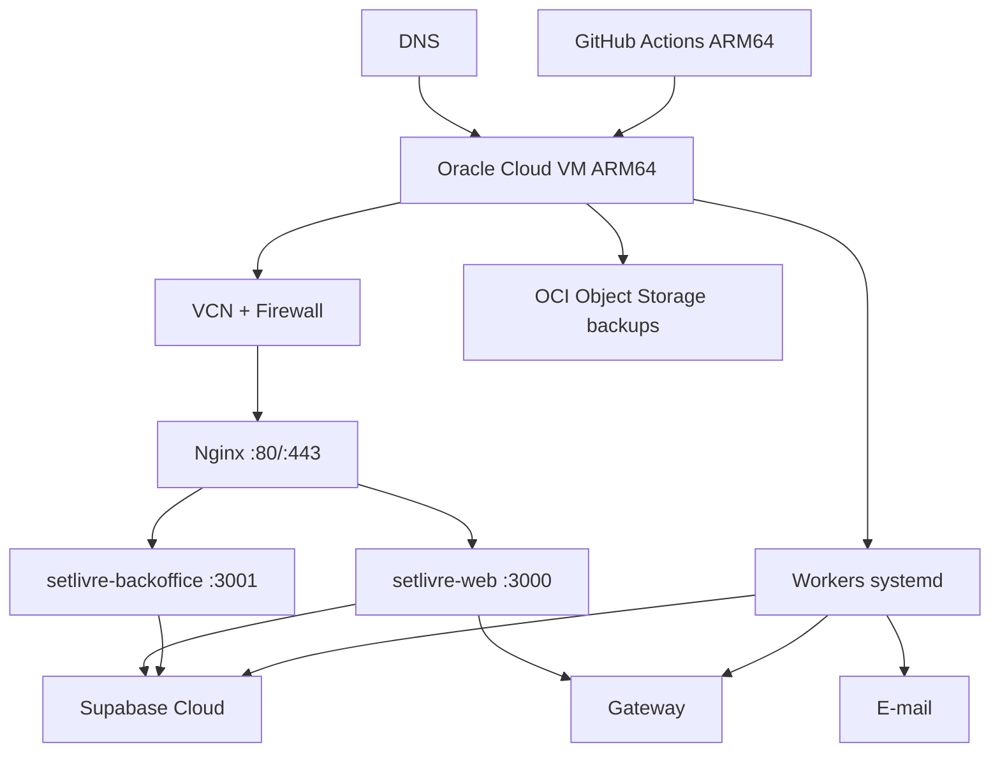

# Infraestrutura, ambientes e deploy

## 1. Topologia



## 2. Ambientes

### Local

- Supabase CLI + Docker;
- app público e backoffice;
- adapter local determinístico quando `APP_ENV=local | test`, sem sandbox remoto;
- e-mail sink;
- único alvo de E2E destrutivo.

### Acceptance

- projeto Supabase separado;
- VM/serviço ativado sob demanda ou namespace isolado;
- provider sandbox somente como topologia alvo após revisão do ADR-018/PEND-004;
- dados sintéticos;
- não manter ocioso sem necessidade.

### Production

- Supabase dedicado;
- VM persistente;
- provider live somente como topologia alvo após contrato e integração aprovados;
- e-mail live;
- domínio/TLS;
- backups;
- alertas.

Credenciais nunca são compartilhadas.

No código implementado nesta etapa, `recipientOnboardingCapability` é derivada server-side por request. `APP_ENV=local | test` produz `local_adapter`; `development | production`, valor ausente ou inválido produzem `unavailable`. Nesses runtimes, recebimentos permanece somente para consulta e start/refresh falham com `503 PAYMENT_PROVIDER_UNAVAILABLE` antes de `prepare`. A tabela acima descreve a topologia final desejada para Acceptance/Production; não afirma sandbox ou provider live já integrados.

## 3. Oracle Cloud

### 3.1 Shape

Default: `VM.Standard.A1.Flex` ARM64 dentro da elegibilidade Always Free da tenancy/região. Dimensionamento de referência: 2 OCPUs e 12 GB, sujeito à disponibilidade e limites atuais da conta.

Sistema: Ubuntu LTS ARM64 mínimo.

### 3.2 Disco

- volume boot com margem para três releases, logs e build;
- aplicação não guarda mídia canônica;
- journald com limite;
- releases antigas limpas após retenção;
- alerta a 70/85/95%.

### 3.3 Rede

Expor:

- 80/TCP para redirecionamento/certificado;
- 443/TCP;
- 22/TCP somente de IP/VPN administrativa.

Portas 3000/3001/worker somente loopback. Backoffice pode usar subdomínio com allowlist/VPN.

## 4. Usuários e diretórios

```text
/opt/setlivre/
├── releases/<sha>/
│   ├── web/
│   ├── backoffice/
│   ├── workers/
│   └── RELEASE.md
├── current -> releases/<sha>
├── previous -> releases/<sha>
└── shared/
    ├── web.env
    ├── backoffice.env
    ├── worker.env
    └── runtime/
```

Usuário `setlivre` sem sudo executa serviços. Deploy user só escreve releases e troca symlinks via script restrito.

## 5. Build

- Next `output: "standalone"`;
- CI release em Linux ARM64;
- `npm ci`;
- gates;
- build público/backoffice/workers;
- copiar `.next/standalone`, `.next/static`, `public`;
- manifest com SHA, Node, lock hash e migration head;
- tar comprimido;
- checksum;
- artifact assinado/protegido quando disponível.

Não usar GHCR.

Na fundação local, `node scripts/release-manifest.mjs` já recompila um checkout limpo com ambientes isolados por app e `BUILD_ID` igual ao SHA, empacota os dois entrypoints com static/public, migrations e lockfile, recusa raiz de artefatos simbólica, montada ou fora do repositório, configuração local, secret incorporado e link externo, e revalida a árvore completa após o smoke. Antes de qualquer `chmod`, lock ou build, o preflight Linux consulta o `mountinfo` do próprio namespace; toda árvore antiga ou candidata passa por inspeção física completa, recusa mount na raiz ou abaixo, é retirada por rename atômico e só então removida após nova comprovação de identidade, forma e mounts. Assim, bind mounts e volumes esquecidos não são atravessados por limpeza recursiva; fora do Linux, uma árvore preexistente exige remoção manual. A entrada direta deriva a versão npm do manifesto da instalação adjacente ao Node atual, validada contra `packageManager`/`devEngines` antes do primeiro build, sem `npm.cmd`, shell ou resolução por `PATH`. Um lock advisory de kernel, mantido por descritor com `util-linux flock`, serializa toda a geração por checkout antes de qualquer build ou temporário compartilhado e é liberado automaticamente ao encerrar o processo. Cada `.env.local` é obrigatório, físico, exclusivo e `0600`; o script o abre sem seguir links, mantém o descritor até terminar a leitura e revalida identidade e modo antes de interpretar o runtime local exato. O readiness empacotado usa somente a URL DAL desse arquivo, validada para o host IPv4 escrito literalmente como `127.0.0.1` e a porta Supabase local, sem aceitar alias, representação alternativa ou override exportado pelo host. Os handlers de interrupção são instalados antes do primeiro spawn; em POSIX, `SIGHUP` encerra ambos os PGIDs detached, elimina descendentes remanescentes e preserva código `129`. O tar usa ordem, ownership, timestamp e modos determinísticos (`0755` para diretórios/executáveis e `0644` para os demais arquivos, sempre removendo `setuid`, `setgid` e `sticky`), é reextraído e comparado à árvore manifestada; um SHA existente nunca é sobrescrito por bytes divergentes. O artefato registra `platform`/`arch`; ele não é apresentado como ARM64 até o smoke real de PEND-003.

O patch local do terceiro P2 passou em gates estáticos, 42/42 unitários focados, 718/718 integrais, 358/358 pgTAP no head `20260815000100` e browser corrigido 114/114. Seu build foi executado exatamente uma vez, terminou com exit `0`, 26 rotas web, quatro do backoffice e zero warning; log SHA-256 `8677b868a632e0891499c8450e5c926ddefcde7e27c5d31f9adcb55e27bbfaa2`. O smoke customizado daquele snapshot também terminou com exit `0` em 2,4 segundos: três probes guest `401` com UUID, dois redirects exatos, 14 nonces web, 11 backoffice, banco/Mailpit `0 → 0`, privacidade e cleanup verdes. SHA-256: stdout `399d3b41dd9d161bdd86288c53e5bf821279285eb4772740c9ff5169845e5abd`, server log `e3c376cdc9403d2739ea8f127244fef193ea0ad4689694fec5c8a097d5ee025b` e resumo `25262fb6efbf93a0a654a16171bc4f6998000ef0078b9d91e40a06beefe79450`. Esses resultados são históricos para o delta de capability.

A release canônica local do terceiro P2 foi gerada e auditada para o commit funcional `2a86acc4dc3a005213d5f22384084e3aba0160be`. O archive possui 24.903.588 bytes e SHA-256 `0e0c07f41d4a44f0673ce7a5013084942100e8baab1ba72ee6aeea6496be1566`; o sidecar, 124 bytes e SHA-256 `1136df426039335971d515497ce8974dcb25ee583f3764d5c33f9ea1f76ca0ab`; o manifesto, 681.529 bytes e SHA-256 `d3bfb5a5c517edab1004bde6eaf04c7f080c3036c94defbbfa1b82fad44d4d44`; e o log, 2.099 bytes e SHA-256 `e7edaa919daa3b3ed4cd6cf1588c044d2a6efcf1ae84e9877edd5fa42062371e`. A árvore manifestada soma 2.870 artefatos — web 1.577, backoffice 1.276, migrations 15, lockfile 1 e manifesto 1 —, enquanto o tar soma 3.454 membros — 584 diretórios, 2.868 arquivos e dois links seguros. Os `BUILD_ID` dos dois apps equivalem ao commit. O head empacotado é `20260815000100`, com prefixo SHA-256 `ca995243...`; o lockfile possui prefixo SHA-256 `485ec8e7...`. Em Linux x64 com Node 24.18/npm 11.19, smoke embutido, varreduras de secrets/PII e cleanup final ficaram verdes, e duas auditorias independentes terminaram `NO-BLOCKER`. A captura remota de `2026-08-15T19:38:32Z` verificou publicação até `dda95b3b9108930489a3b10275ef41c2f203ae24`, resposta/resolução e zero threads não resolvidas. Essa prova é histórica para a capability, não equivale a ARM64 ou produção, e PEND-003/smoke ARM64 nativo continuam obrigatórios.

No quarto P2, o fechamento estático (734/734 unitários), o banco 358/358 e o browser 23/23 + 114/114 passaram. Um único build de validação terminou com exit `0`, 26 rotas web, quatro do backoffice e `BUILD_ID=local`; log SHA-256 `ca7d5c3e98449ea03a4cedbc567d93f989db7dbfdac854ea1a19f40f0c26b0b3`. O smoke customizado não é evidência verde. A tentativa 1 foi recusada por um oráculo que tratou tombstone segura de cookie como violação; a tentativa 2 terminou com exit `1` apesar de cumprir o contrato completo — três boundaries, dois redirects, 14/11 nonces, 15 relações e Mailpit em zero —, porque o postcheck produziu um falso positivo contra o shell pai; a tentativa 3 foi recusada antes dos probes porque o parser não aceitava `pgrp=0`. O cleanup terminou em zero nas três; nenhuma tentativa customizada é apresentada como aprovada.

O gerador canônico processou exatamente uma vez o commit funcional `969f30cd0f34b7e36e2a21550b5e3f28f8709406`, terminou com exit `0` em 21,15 segundos e gerou a release local do quarto P2. Archive/sidecar/manifesto/log possuem 24.904.533/124/681.762/2.102 bytes e SHA-256 `d5f544bff8b72314060535333cd2c300a4c56a4e35295c1471beec5ee41cfeeb`/`f3441aee4c9d6758a539b2be2b3b325805bd6d977ad2cf915619bfbb9cd4d8d3`/`bc13a94c4084abc46bab677d1115871cb1327d7d17172b982b886c35eb200ada`/`5be766c1c967ab7840335c120f2918ff555770efd69544f164023c32378456e7`. A árvore soma 2.871 artefatos — web 1.578, backoffice 1.276, migrations 15, lockfile 1 e manifesto 1 —; o tar soma 3.455 membros — 584 diretórios, 2.869 arquivos e dois links seguros. Os dois `BUILD_ID` equivalem ao commit. Smoke embutido, secrets, paridade e cleanup ficaram verdes, e duas auditorias independentes terminaram `NO-BLOCKER`. Essa é prova local Linux x64, não ARM64 ou produção; publicação e PEND-003 permanecem pendentes.

O build histórico foi executado uma única vez em Node 24: `npm run build` terminou com exit `0`, sem warnings; log SHA-256 `db0d0049b248dd7b3d438d57ffa0faa465d3cd7a15a9bdd0d6267dc11a4ac162`.

A release canônica local histórica foi gerada uma única vez para o commit funcional `440c81f6cc44cc95ed281d84e9a5124ae98a59c4`, com exit `0` e log SHA-256 `be9e2e2d0d1d2a4db78593c03858c183f93b3ed336bd820d3ce9d64c08ec1ba4`. O archive possui 14 migrations/head `20260812000200`; tar, sidecar, smoke embutido, segurança, buscas de secrets/PII e cleanup ficaram verdes naquele snapshot. Ele não contém `20260815000100`, não valida o patch atual e tampouco equivale a ARM64/produção.

As releases `c115dcd726929f289777cd897cccc97d33a179ee`, `79376b62bdce788c9eb7e1f1696d5acfde0cb215` e `440c81f6...` são históricas diante do patch local atual. Nenhuma fotografia comprova ARM64 ou produção. PEND-003 e o smoke ARM64 nativo permanecem obrigatórios.

O smoke runtime histórico, padrão mais FEAT-004, terminou com exit `0`; resumo SHA-256 `a8d41974344ba6eb3b6cb83d626e4b77e9853a2d98e58814d9c795cca356ad0b`, stdout `e15829cc6525d58cab4fa2ed49c33d9e5d6225512b77ec96a21fa2ea3b9703dba` e server log redigido SHA-256 `7ea7719b4af0257044c24c32f252f9327920a069d74b31cac25d3f23d8f089c5`. Esse run não inclui a migration atual.

A primeira tentativa do runner temporário foi recusada antes de spawn porque consultava `profile_preferences` em vez de `user_preferences`; log SHA-256 `9757fbc1baf5afcffc4840468f7f7af5c7c1677a924997184376617b8752e2db`. Não houve servidor, request ou temporário residual. A correção alterou somente o harness e foi seguida pela única execução real verde.

Duas tentativas customizadas foram recusadas pelo harness antes de spawn, servidor ou request: a primeira por `E2E_BASE_URL` pública e a segunda pela ocorrência rastreada de `E2E_DATABASE_URL` em `package.json`. O scanner final path-aware/canônico passou e reconheceu a URL administrativa E2E somente na ocorrência exata esperada do `package.json`; os rejects não são runs de smoke.

## 6. systemd

Serviços:

- `setlivre-web.service`;
- `setlivre-backoffice.service`;
- `setlivre-email-worker.service`;
- timers para expiração/reconciliação/payout/backup, ou workers persistentes conforme implementação.

Baseline de unit:

```ini
[Service]
User=setlivre
WorkingDirectory=/opt/setlivre/current/web
EnvironmentFile=/opt/setlivre/shared/web.env
ExecStart=/usr/bin/node server.js
Restart=on-failure
RestartSec=5
NoNewPrivileges=true
PrivateTmp=true
ProtectSystem=strict
ProtectHome=true
ReadWritePaths=/opt/setlivre/shared/runtime
MemoryMax=2G
TasksMax=256
```

Ajustar paths necessários; não copiar unit sem testar.

## 7. Nginx

Responsabilidades:

- TLS;
- redirect HTTP→HTTPS;
- reverse proxy;
- request/body limits;
- timeouts;
- headers;
- compressão;
- cache de estáticos;
- logs;
- rate limiting de borda quando útil.

Para liberar as rotas Auth em produção, o bloco Nginx precisa preservar o `Host` público exato e substituir — nunca anexar — `X-Forwarded-Host`, `X-Forwarded-Proto=https` e `X-Forwarded-For` pelo host, protocolo e endereço remoto canônicos recebidos na borda. O app recusa qualquer divergência e aplica o bucket pré-Zod por ação/IP. A camada interna preserva buckets exatos vivos e, quando satura, usa overflow sticky e conservador por ação; ela continua restrita ao processo e não absorve sozinha um ataque distribuído. O limiter Nginx permanece obrigatório para impedir que tráfego hostil alcance o processo Node. Essa prova integra o critério externo de PEND-003 e não é simulada pelo loopback local.

Rotas:

- `www/setlivre` → 3000;
- `ops` → 3001 + restrição;
- `/api/webhooks` com body limit específico e sem cache;
- `/_next/static` cache longo com hash.

Não cachear resposta autenticada ou checkout.

A CSP de HTML nasce no Proxy de cada app, antes da renderização, porque o nonce precisa existir simultaneamente no request interno, no header da response e nos scripts emitidos pelo Next. O matcher não confia em headers de prefetch, prefixos parecidos com rotas reservadas nem no pressuposto de que toda resposta sob `/_next/static/` será um asset: o Proxy também cobre esse namespace para proteger os erros HTML que o framework pode produzir, sem alterar o `Cache-Control` imutável dos arquivos válidos. Os root layouts chamam `connection()` deliberadamente: toda rota HTML abaixo deles é dinâmica, recebe nonce novo e `Cache-Control` privado sem armazenamento, portanto não usa geração estática, ISR, PPR ou cache de HTML em CDN. O fallback global é um HTML mínimo, sem scripts e com `no-store`, para não reutilizar o documento estático interno do framework. Esse custo de render por request é aceito pela baseline de segurança e deve ser medido antes de qualquer mudança; Nginx preserva a CSP da aplicação e continua cacheando somente assets imutáveis `/_next/static`.

## 8. TLS

- Certbot/ACME;
- renovação systemd timer;
- alerta de expiração;
- HSTS somente após validar subdomínios;
- TLS moderno.

## 9. CI de pull request

1. checkout action por SHA;
2. setup Node;
3. `npm ci`;
4. format;
5. lint;
6. typecheck;
7. unit;
8. Supabase start/reset;
9. DB/RLS guards;
10. docs check;
11. build das duas apps;
12. Playwright affected;
13. audit;
14. Knip;
15. artifacts de falha.

## 10. Release

1. merge em main;
2. suíte completa;
3. build ARM64;
4. gerar artifact/checksum;
5. upload para `/opt/setlivre/releases/<sha>.incoming`;
6. verificar checksum;
7. extrair em diretório novo;
8. validar env e versão;
9. aplicar migrations com lock;
10. apontar `previous`;
11. trocar `current` atomicamente;
12. daemon-reload se necessário;
13. restart workers/backoffice/web;
14. health interno;
15. smoke HTTPS;
16. registrar release.

## 11. Rollback

Se health/smoke falhar:

1. trocar `current` para `previous`;
2. restart;
3. smoke;
4. registrar incidente;
5. não reverter migration destrutiva automaticamente.

Migrations usam expand/migrate/contract para compatibilidade entre release atual/anterior.

## 12. Secrets

Separados:

- web public/server;
- backoffice;
- workers;
- CI deploy.

Permissões 600. Rotação e owner documentados. Não ecoar em scripts.

## 13. Jobs

### Expiração

Cada minuto.

### Reconciliação

A cada 2 minutos ou worker contínuo com backoff.

### Payout

A cada 10 minutos.

### E-mail

Contínuo/intervalo curto.

### Backup

Diário em horário de menor uso.

Todos usam locks e métricas.

## 14. Capacidade e gatilhos

A VM free tier é baseline, não promessa de escala.

Migrar/expandir quando:

- CPU p95 > 70% por 15 min recorrente;
- memória > 80%;
- swap;
- event loop lag;
- fila > SLO;
- deploy impacta runtime;
- necessidade de alta disponibilidade;
- backoffice disputa recursos;
- tráfego supera egress;
- Oracle reclaim/availability incompatível.

## 15. Supabase em produção

Para fotos e operação comercial, o plano gratuito pode ser insuficiente. Produção deve revisar:

- storage;
- egress;
- database size;
- backups;
- Auth MAU;
- image transformation;
- SLA/suporte.

Acceptance e produção também precisam fixar a expiração do JWT Auth em exatamente `3600` segundos antes de receber tráfego. A binding/tombstone de recovery deriva sua retenção do `exp` assinado, e as funções privadas de emissão/inspeção e o readiness falham fechado quando `app.settings.jwt_exp` diverge. Alterar essa duração exige adaptar primeiro o contrato de retenção e seus testes; PEND-002 continua bloqueando a prova correspondente no Supabase Cloud.

O custo do Supabase e providers não está coberto pela VM gratuita.
