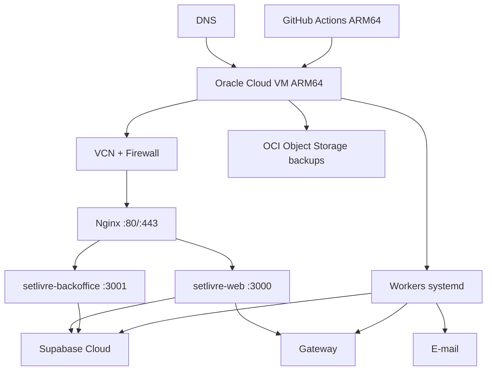

# Infraestrutura, ambientes e deploy

## 1. Topologia



## 2. Ambientes

### Local

- Supabase CLI + Docker;
- app público e backoffice;
- provider fake/sandbox;
- e-mail sink;
- único alvo de E2E destrutivo.

### Acceptance

- projeto Supabase separado;
- VM/serviço ativado sob demanda ou namespace isolado;
- provider sandbox;
- dados sintéticos;
- não manter ocioso sem necessidade.

### Production

- Supabase dedicado;
- VM persistente;
- provider live;
- e-mail live;
- domínio/TLS;
- backups;
- alertas.

Credenciais nunca são compartilhadas.

## 3. Oracle Cloud

### 3.1 Shape

Default: `VM.Standard.A1.Flex` ARM64 dentro da elegibilidade Always Free da tenancy/região. Dimensionamento de referência: 2 OCPUs e 12 GB, sujeito à disponibilidade e limites atuais da conta.

Sistema: Ubuntu LTS ARM64 mínimo.

### 3.2 Disco

- volume boot com margem para três releases, logs e build;
- aplicação não guarda mídia canônica;
- journald com limite;
- releases antigas limpas após retenção;
- alerta a 70/85/95%.

### 3.3 Rede

Expor:

- 80/TCP para redirecionamento/certificado;
- 443/TCP;
- 22/TCP somente de IP/VPN administrativa.

Portas 3000/3001/worker somente loopback. Backoffice pode usar subdomínio com allowlist/VPN.

## 4. Usuários e diretórios

```text
/opt/setlivre/
├── releases/<sha>/
│   ├── web/
│   ├── backoffice/
│   ├── workers/
│   └── RELEASE.md
├── current -> releases/<sha>
├── previous -> releases/<sha>
└── shared/
    ├── web.env
    ├── backoffice.env
    ├── worker.env
    └── runtime/
```

Usuário `setlivre` sem sudo executa serviços. Deploy user só escreve releases e troca symlinks via script restrito.

## 5. Build

- Next `output: "standalone"`;
- CI release em Linux ARM64;
- `npm ci`;
- gates;
- build público/backoffice/workers;
- copiar `.next/standalone`, `.next/static`, `public`;
- manifest com SHA, Node, lock hash e migration head;
- tar comprimido;
- checksum;
- artifact assinado/protegido quando disponível.

Não usar GHCR.

Na fundação local, `node scripts/release-manifest.mjs` já recompila um checkout limpo com ambientes isolados por app e `BUILD_ID` igual ao SHA, empacota os dois entrypoints com static/public, migrations e lockfile, recusa raiz de artefatos simbólica, configuração local, secret incorporado e link externo, e revalida a árvore completa após o smoke. A entrada direta deriva a versão npm do manifesto da instalação adjacente ao Node atual, validada contra `packageManager`/`devEngines` antes do primeiro build, sem `npm.cmd`, shell ou resolução por `PATH`. Um lock advisory de kernel, mantido por descritor com `util-linux flock`, serializa toda a geração por checkout antes de qualquer build ou temporário compartilhado e é liberado automaticamente ao encerrar o processo. O readiness empacotado usa somente a URL DAL do arquivo local de cada app, validada para a instância Supabase em loopback, sem aceitar override exportado pelo host. O tar usa ordem, ownership, timestamp e modos determinísticos (`0755` para diretórios/executáveis e `0644` para os demais arquivos, sempre removendo `setuid`, `setgid` e `sticky`), é reextraído e comparado à árvore manifestada; um SHA existente nunca é sobrescrito por bytes divergentes. O artefato registra `platform`/`arch`; ele não é apresentado como ARM64 até o smoke real de PEND-003.

## 6. systemd

Serviços:

- `setlivre-web.service`;
- `setlivre-backoffice.service`;
- `setlivre-email-worker.service`;
- timers para expiração/reconciliação/payout/backup, ou workers persistentes conforme implementação.

Baseline de unit:

```ini
[Service]
User=setlivre
WorkingDirectory=/opt/setlivre/current/web
EnvironmentFile=/opt/setlivre/shared/web.env
ExecStart=/usr/bin/node server.js
Restart=on-failure
RestartSec=5
NoNewPrivileges=true
PrivateTmp=true
ProtectSystem=strict
ProtectHome=true
ReadWritePaths=/opt/setlivre/shared/runtime
MemoryMax=2G
TasksMax=256
```

Ajustar paths necessários; não copiar unit sem testar.

## 7. Nginx

Responsabilidades:

- TLS;
- redirect HTTP→HTTPS;
- reverse proxy;
- request/body limits;
- timeouts;
- headers;
- compressão;
- cache de estáticos;
- logs;
- rate limiting de borda quando útil.

Rotas:

- `www/setlivre` → 3000;
- `ops` → 3001 + restrição;
- `/api/webhooks` com body limit específico e sem cache;
- `/_next/static` cache longo com hash.

Não cachear resposta autenticada ou checkout.

## 8. TLS

- Certbot/ACME;
- renovação systemd timer;
- alerta de expiração;
- HSTS somente após validar subdomínios;
- TLS moderno.

## 9. CI de pull request

1. checkout action por SHA;
2. setup Node;
3. `npm ci`;
4. format;
5. lint;
6. typecheck;
7. unit;
8. Supabase start/reset;
9. DB/RLS guards;
10. docs check;
11. build das duas apps;
12. Playwright affected;
13. audit;
14. Knip;
15. artifacts de falha.

## 10. Release

1. merge em main;
2. suíte completa;
3. build ARM64;
4. gerar artifact/checksum;
5. upload para `/opt/setlivre/releases/<sha>.incoming`;
6. verificar checksum;
7. extrair em diretório novo;
8. validar env e versão;
9. aplicar migrations com lock;
10. apontar `previous`;
11. trocar `current` atomicamente;
12. daemon-reload se necessário;
13. restart workers/backoffice/web;
14. health interno;
15. smoke HTTPS;
16. registrar release.

## 11. Rollback

Se health/smoke falhar:

1. trocar `current` para `previous`;
2. restart;
3. smoke;
4. registrar incidente;
5. não reverter migration destrutiva automaticamente.

Migrations usam expand/migrate/contract para compatibilidade entre release atual/anterior.

## 12. Secrets

Separados:

- web public/server;
- backoffice;
- workers;
- CI deploy.

Permissões 600. Rotação e owner documentados. Não ecoar em scripts.

## 13. Jobs

### Expiração

Cada minuto.

### Reconciliação

A cada 2 minutos ou worker contínuo com backoff.

### Payout

A cada 10 minutos.

### E-mail

Contínuo/intervalo curto.

### Backup

Diário em horário de menor uso.

Todos usam locks e métricas.

## 14. Capacidade e gatilhos

A VM free tier é baseline, não promessa de escala.

Migrar/expandir quando:

- CPU p95 > 70% por 15 min recorrente;
- memória > 80%;
- swap;
- event loop lag;
- fila > SLO;
- deploy impacta runtime;
- necessidade de alta disponibilidade;
- backoffice disputa recursos;
- tráfego supera egress;
- Oracle reclaim/availability incompatível.

## 15. Supabase em produção

Para fotos e operação comercial, o plano gratuito pode ser insuficiente. Produção deve revisar:

- storage;
- egress;
- database size;
- backups;
- Auth MAU;
- image transformation;
- SLA/suporte.

O custo do Supabase e providers não está coberto pela VM gratuita.
