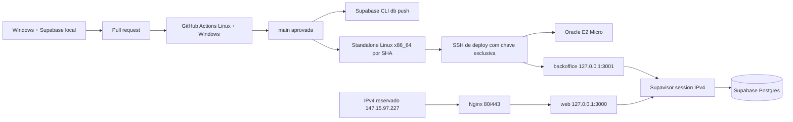

# Infraestrutura, ambientes e deploy

Esta é a fonte canônica da operação técnica. Decisões ficam nos ADRs 014, 019, 020 e 021; resultados
de uma execução pertencem ao check, deployment ou PR que os produziu.

## Contrato vigente

| Componente        | Contrato                                                                                       |
| ----------------- | ---------------------------------------------------------------------------------------------- |
| desenvolvimento   | Windows nativo, Node 24.18, npm 11.19 e Supabase local em Docker Desktop                       |
| produção de dados | Supabase Cloud `oirvvnojgkzdppkdvhej`, `sa-east-1`, sem branches remotas nesta fase            |
| produção web      | Oracle E2 Micro Always Free-eligible x86_64, Ubuntu 24.04, 50 GB, IP reservado `147.15.97.227` |
| origem web        | `https://147.15.97.227`, com indexação bloqueada até o go-live                                 |
| backoffice        | somente `127.0.0.1:3001`; exposição pública adiada                                             |
| entrega           | GitHub Actions, migrations forward-only e release imutável por SHA                             |

Não existe acceptance remoto. Testes destrutivos, seeds e usuários QA ficam exclusivamente no ambiente
local. `main` representa produção e só recebe mudanças pelo [ciclo obrigatório](review-deploy-cycle.md).

## Topologia



Produção não usa Docker, build na VM, registry de imagem, runner self-hosted, agente de polling ou login
OCI em cada merge.

A retirada do antigo agente pull é uma migração administrativa única, não uma camada de compatibilidade
permanente. O host final não conserva suas units, executáveis, usuários, credenciais ou árvore de
release; antes de qualquer mutação, o bootstrap recusa a presença de qualquer path ou identidade dessa
superfície aposentada. Assim, um snapshot antigo ou configuração manual não pode reativar silenciosamente
o segundo mecanismo de deploy.

## Desenvolvimento local

`npm run local:setup` inicia a stack oficial da Supabase CLI, recria o banco e grava três arquivos
ignorados: `.env.local`, `apps/backoffice/.env.local` e `.env.e2e.local`. O login DAL local é exclusivo,
assume `app_dal` e não aceita host diferente de `127.0.0.1`.

O banco local contém somente dados QA descartáveis. Não há benefício proporcional em adicionar uma
segunda camada de firewall local; a segurança essencial é nunca reutilizar credencial ou dado de
produção. Consulte [development.md](development.md).

## CI e proteção de branch

O workflow `.github/workflows/ci.yml` contém três jobs:

1. **Quality, local Supabase and browser gates**: gates estáticos, Vitest, reset e pgTAP local, suíte
   Playwright completa, build, pacote, `actionlint`, prova dos contratos Nginx/systemd/SSH, ativação,
   falhas e recuperação do instalador, além do smoke standalone Linux x86_64;
2. **Windows native contracts**: contratos TypeScript/Vitest e build/pacote no ambiente Windows;
3. **Deploy production**: somente em push de `main`, depois dos dois jobs verdes e quando
   `PRD_DEPLOY_ENABLED=true`.

`workflow_dispatch` permite repetir manualmente os dois gates sem fabricar commit quando o evento do
GitHub não cria uma check suite. Esse evento nunca satisfaz a condição do job de produção, que continua
restrito ao `push` de `main` com a flag explícita.

Workflows de pull request não recebem secrets de produção e o checkout remove a credencial Git depois
da clonagem. Cada gate relevante possui step próprio; Actions externas são oficiais e fixadas por SHA.
Quando a suíte Playwright falha, o CI preserva por sete dias somente seu relatório, traces, screenshots
e vídeos em um artifact identificado pela execução; runs verdes não acumulam evidência redundante.
Os dois primeiros nomes são contexts obrigatórios da branch protection. O terceiro context,
`Codex review contract`, não é um job: uma credencial confiável o publica somente depois do ciclo de
review limpo descrito em [review-deploy-cycle.md](review-deploy-cycle.md).

## Release e deploy

`npm run release` exige que os dois `BUILD_ID` sejam o SHA Git completo e cria somente:

```text
.artifacts/release/
├── web/
├── backoffice/
└── release-manifest.json
```

Antes de remover qualquer artifact anterior, o empacotador exige que `.artifacts` e cada componente
existente do destino sejam diretórios físicos sob a raiz física do repositório; symlink ou junction em
qualquer ancestral falha sem tocar seu alvo.

No merge, o workflow:

1. aplica migrations pendentes com `supabase db push --linked`, sem seed;
2. usa o project ref literal versionado e valida o contrato fixo antes da primeira escrita cloud;
3. aplica migrations e exige que o maior head remoto seja exatamente o head compilado pelo candidato;
4. inicializa a identidade restrita somente se a migration acabou de criá-la como `NOLOGIN`; um
   resultado ambíguo do commit abre conexões administrativas novas, força `NOLOGIN` de forma
   idempotente e exige releitura positiva antes de falhar; nos deploys seguintes apenas valida a
   credencial existente, sem rotacioná-la ou imprimi-la;
5. constrói web e backoffice para o SHA aprovado com URL DAL estrutural não secreta;
6. recusa segredo no artifact, cria duas vezes o tar normalizado e exige bytes idênticos;
7. envia o archive e dois ambientes efêmeros pelo comando SSH forçado;
8. executa o instalador root allowlisted;
9. verifica readiness interno dos dois apps e HTTPS público durante a ativação, e repete o health
   público a partir do runner.

O instalador `ops/deploy-release.sh` valida caminho, ownership, checksum, manifesto, entrypoints,
ambientes e o digest da configuração efetivamente instalada no host. Antes de extrair limita tamanho e
interrompe a leitura no primeiro header além das 20.000 entradas permitidas, sem materializar uma lista
não limitada; aceita somente diretórios e arquivos regulares nas três raízes esperadas. Cada
SHA ocupa `/opt/set-livre/releases/<sha>` junto aos ambientes e à identidade do mesmo SHA. O link
`/opt/set-livre/current` só é aceito quando resolve exatamente para essa raiz SHA, nunca para um filho;
só então sua troca ativa a unidade inteira, reinicia os serviços e exige readiness interno e
HTTPS público. Um marcador root-only preserva o alvo anterior até o commit do health; traps restauram
esse alvo em erro, `HUP`, `INT` ou `TERM`. No boot, a instância oneshot `@link` recupera o symlink antes
dos apps. Em paralelo, uma path unit observa o marcador e dispara a instância `@services`, que aguarda
o lock do deploy por no máximo cinco minutos e estabiliza serviços e health após `SIGKILL`; essa
instância depende de `network-online.target` e `nginx.service` e recebe do systemd uma janela de doze
minutos, suficiente para o lock e para os dois health checks limitados. Uma fase root-only adicional é
publicada em disco antes de remover o blocker do bootstrap e permanece até o readiness terminal. Se o
processo recebe `SIGKILL`, `ExecStopPost` recompõe o blocker a partir dessa fase e interrompe os apps; se
o host perde energia, `@link` faz o mesmo antes que as units possam iniciar. O link só é alterado depois
de autenticar blocker/fase, digest instalado e manifesto da release. Recuperar o link nunca consome o marcador; todos os caminhos
de rollback, boot e retry só o removem depois de estabilizar os serviços e provar readiness interno e
HTTPS público. Uma falha mantém o marcador para nova tentativa e interrompe os serviços. A path unit
apenas encerra sem trabalho se o deploy normal já removeu o marcador. Rollback incapaz de voltar ao
readiness interno e HTTPS público interrompe os serviços. Um SHA existente só pode ser reutilizado
quando artifact, ambientes e o digest determinístico da árvore instalada completa correspondem à
árvore recém-preparada; alteração de conteúdo, caminho, tipo, owner, grupo ou modo falha antes de
descartar o staging. A retenção ocorre antes da ativação e mantém no máximo quatro releases, incluindo
candidata e anterior.
Ordem, timestamps, owner e gzip são normalizados pelo timestamp do commit para que retry do mesmo SHA
produza o mesmo checksum.
O empacotador percorre o standalone sem preservar referências de filesystem: links simbólicos cujos
alvos permanecem na própria árvore ou no `node_modules` instalado pelo lockfile, além de hard links, são
materializados como arquivos ou diretórios independentes. Links que escapam dessas raízes, ciclos e
objetos especiais falham fechado. O archive também desduplica inodes defensivamente. O instalador
permanece estrito e rejeita links simbólicos, hard links e qualquer tipo de entrada diferente de arquivo
regular ou diretório.
Antes da compactação, o empacotador também recusa `.env` e ocorrências exatas das credenciais de banco
disponíveis ao processo; o artifact parcial é removido em caso de falha.

Migrations não sofrem rollback automático. Mudanças usam expand/contract em PRs separados: o health
aceita o head compilado de uma release enquanto ele existir no histórico aplicado, preservando a
release anterior durante a ativação, mas o deploy exige que o maior head remoto corresponda exatamente
ao candidato antes de publicar. O gate de PR também recusa `databaseMigrationHead` diferente da
migration mais recente, impedindo que um schema forward-only seja aplicado antes de detectar o contrato
compilado obsoleto. Alterações destrutivas exigem backup e recuperação comprovada.

## Host Oracle

`ops/bootstrap-host.sh` é idempotente para a VM dedicada e instala apenas:

- Node 24.18 x86_64 verificado pelos `SHASUMS256` oficiais, extraído em staging, validado como árvore
  root-only funcional e publicado por rename somente depois da prova integral; o alias canônico
  `/opt/node` também é preparado como link validado, substitui diretório legado por quarentena
  recuperável e só então é publicado;
- Nginx, systemd, OpenSSH, `iptables-persistent`, Fail2ban, Certbot oficial via Snap e atualizações
  automáticas;
- units systemd habilitadas, porém inativas antes da primeira release; cada unit exige seu entrypoint
  imutável e limita tentativas de restart para não criar loop em host vazio ou artefato inválido;
- pelo menos 1 GiB de swap para reduzir risco de OOM no shape de 1 GB; somente arquivo regular,
  root-owned, `0600`, sem hard link e já formatado como swap é preservado, e qualquer estado inválido é
  removido sem seguir symlink nem apagar diretório recursivamente antes da substituição atômica;
- usuários sem senha separados `setlivre-web` e `setlivre-backoffice`, com home inexistente e shell de
  nologin, além de `deploy-setlivre` com home e shell estritamente fixados para entrega por chave;
- units, sites Nginx, comando SSH forçado e instalador de release revisados no repositório.

Diretórios e identidades:

```text
/opt/set-livre/releases/<sha>    root:setlivre 0750
  .runtime/web.env               root:setlivre-web 0640
  .runtime/backoffice.env        root:setlivre-backoffice 0640
  .runtime/release.env           root:setlivre 0640
/opt/set-livre/current           symlink para código + ambientes do mesmo SHA
/opt/set-livre/.activation-rollback marcador transitório root:root 0600
/home/deploy-setlivre            root:deploy-setlivre 0750
/home/deploy-setlivre/.ssh       root:deploy-setlivre 0750
/home/deploy-setlivre/.ssh/authorized_keys root:deploy-setlivre 0640
/home/deploy-setlivre/incoming   deploy-setlivre:deploy-setlivre 0700
/home/deploy-setlivre/incoming/.incoming.lock deploy-setlivre 0600
/etc/set-livre/host-config.sha256 root:setlivre 0640
/etc/set-livre/host-config.previous.sha256 root:setlivre 0640, somente durante bootstrap
/etc/set-livre/bootstrap-in-progress.sha256 root:root 0600, somente durante bootstrap
/etc/set-livre/bootstrap-recovery-in-progress.sha256 root:root 0600, até readiness terminal
/etc/set-livre/supabase-root-2021-ca.crt root:root 0644
```

Os processos Node executam com UIDs e arquivos de ambiente separados, sem root, com `NoNewPrivileges`,
devices privados, capabilities vazias, namespaces/realtime bloqueados, filesystem protegido e apenas
AF_UNIX/IPv4/IPv6. O grupo compartilhado `setlivre` concede somente leitura do artifact e do SHA
ativo. O workflow sincroniza em cada release somente as cinco chaves esperadas (`APP_ENV`, URL DAL,
origem do app, URL e publishable key do Supabase); o instalador recusa chave extra, encoding inválido,
projeto/role/host divergente, qualquer chave que não use `sb_publishable_` ou ambiente entre os apps
inconsistente. Antes de escrever qualquer chave, o bootstrap exige nomes, UIDs não root, grupos
primários e suplementares exatos, ausência de membros reversos inesperados, homes, shells e senhas
bloqueadas para as três identidades; uma conta preexistente divergente falha fechada. Home e `.ssh` do
deployer são root-owned, cada diretório gerenciado é aberto com `O_NOFOLLOW` antes de qualquer mudança
de owner ou modo, percorrendo cada componente desde `/`, inclusive `/opt/set-livre`, `releases` e toda a
cadeia `/var/www/set-livre-acme/.well-known/acme-challenge`; sem marcador válido, uma raiz operacional já
existente é recusada. Em retry gerenciado, a cadeia existente também é validada antes de consultar o
rollback ou remover um `current` pendente. Somente `incoming` permanece gravável pelo deployer. Em
seguida, o bootstrap exige
exatamente uma chave pública, decodifica o blob SSH, comprova o algoritmo Ed25519 e os 32 bytes de
material e substitui `authorized_keys` por rename atômico. A chave instalada usa
`authorized_keys command=` e aceita apenas
uploads limitados e `deploy <sha> <checksum>`; não abre
shell, SCP genérico ou comando arbitrário. Somente o instalador pode ser executado como root. Ambientes
antigos permanecem protegidos dentro das releases retidas e são removidos pela mesma política de
retenção; uma credencial alterada exige novo SHA, nunca reescrita silenciosa de release.

Uploads usam lock próprio e o diretório `incoming` conserva no máximo o SHA em preparação. Antes de
cada comando, nomes temporários interrompidos e artifacts de outro SHA são removidos somente após
validar nome, arquivo regular, owner e modo; entrada divergente bloqueia o fluxo. Assim, cancelamento
entre upload e deploy não acumula archives de até 256 MiB nem pode apagar caminho arbitrário. Sob o
lock de deploy, o instalador privilegiado valida novamente o diretório e o arquivo de lock, readquire o
lock de upload fechado pelo `sudo` e o mantém enquanto copia os três inputs para arquivos root-only. A
mesma regra remove cópias confiáveis residuais em `/var/tmp` antes de criar outra. Assim, outro upload
não pode substituir archive ou ambiente entre validação e cópia, nem mesmo em retry do mesmo SHA.

Depois de adquirir o lock exclusivo, o instalador remove somente diretórios residuais que correspondem
exatamente a `.staging-<sha>.<sufixo-mktemp>`, são diretórios reais dentro de `releases` e pertencem a
`root`. Isso recupera `SIGKILL` ou reboot entre extração e rename sem aceitar path genérico; nome,
owner ou tipo divergente bloqueia a ativação para inspeção.

Antes de abrir o archive com `tarfile`, uma pré-varredura streaming lê blocos fixos do TAR, limita cada
header PAX/GNU a 64 KiB, limita a metadata acumulada a 8 MiB, rejeita sparse e encerra no máximo de
headers e bytes descompactados. Só então a extração valida as até 20.000 entradas e 512 MiB de conteúdo;
um gzip pequeno não consegue provocar alocação de metadata proporcional ao tamanho declarado.

O manifesto contém o SHA-256 determinístico dos dez arquivos que definem o host. Antes de qualquer
mutação gerenciada, o bootstrap compara esse digest com o manifesto da release ativa e publica
atomicamente um marcador `bootstrap-in-progress` root-only. Quando existe contrato ativo válido,
preserva sua cópia `host-config.previous`, invalida o digest ativo e interrompe os apps antes de alterar
pacotes ou qualquer superfície gerenciada. As units exigem simultaneamente o digest ativo e a ausência
de `bootstrap-in-progress`; um reboot durante as mutações não reinicia a release. Depois de validar
integralmente as superfícies estáticas, o bootstrap publica o novo
`/etc/set-livre/host-config.sha256` por rename atômico enquanto ainda mantém o marcador transitório; o
instalador de release rejeita esse estado. Quando a release é compatível, o bootstrap arma primeiro o
marcador de rollback para a própria raiz SHA, persiste a fase de recovery e só então remove o in-progress
que bloqueia as units. A
recuperação existente permanece responsável pela transição até os dois readiness internos e o HTTPS
público passarem. Quando os marcadores coexistem após uma interrupção, ela só libera os serviços se o
blocker ou a fase durável, `host-config.sha256` e o digest do manifesto da release apontada forem
idênticos e tiverem tipo, owner e modo exatos. Essa autenticação termina antes de qualquer troca de
`current`; estado inválido não altera o link ativo. Falha de readiness republica atomicamente o bloqueio de
bootstrap antes de parar os serviços e preserva fase e rollback para retry; estado divergente permanece
intocado e falha fechado. Reboot relê a fase antes do start; `SIGKILL` aciona o selamento do systemd e
estabiliza a mesma release em uma nova tentativa.
Somente depois dessa prova o bootstrap desarma o rollback. Se os digests divergirem, o symlink
ativo é retirado sem apagar o diretório imutável e os apps permanecem parados até o deploy do artifact
correto. Se uma release compatível não recuperar readiness interno e público depois do estado terminal,
os serviços param e o symlink é retirado, mas o host válido permanece pronto para receber novamente uma
release aprovada. Se o health falha, o bootstrap republica o in-progress antes de retirar o symlink e o
rollback, mantendo boot e deploy bloqueados até uma reexecução segura. Um `current` pendente, cujo
destino já não existe, é removido pelo bootstrap antes da
validação de release para que uma entrega aprovada possa reparar o host. Se Nginx, systemd, CA,
bootstrap, comando SSH ou instalador mudarem, o
deploy falha antes da ativação até que o agente reaplique o bootstrap pela conta administrativa.
Uma reexecução reconhece os caminhos reutilizados `/opt/node-v24.18.0`, `/opt/set-livre` e
`/opt/setlivre` somente quando
ao menos um marcador de estado válido é arquivo regular, root-owned, tem modo exato e contém um único
SHA-256: o ativo/anterior usa `root:setlivre 0640` e o in-progress usa `root:root 0600`. Sem essa prova,
esses caminhos continuam tratados como resíduo da arquitetura retirada e o bootstrap falha fechado.
Quando a release ativa já carrega o mesmo digest candidato, a reaplicação publica a configuração
estática, arma a recuperação, libera o start controlado e prova o mesmo SHA nos endpoints internos e no
HTTPS público antes de remover o rollback. Falha anterior mantém `bootstrap-in-progress`, remove o
digest candidato e bloqueia boot/deploy até a reexecução. Falha de health rearma esse bloqueio antes de
desativar o symlink; não existe janela em que reboot possa iniciar uma release ainda não validada.

### Rede e SSH

NSG e a cadeia persistente `SETLIVRE_INPUT` expõem somente:

- `22/tcp`: SSH por chave Ed25519, sem senha/root, com bloqueio de tentativas pelo Fail2ban;
- `80/tcp`: ACME e redirecionamento para HTTPS após emissão;
- `443/tcp`: aplicação.

Portas 3000 e 3001 escutam em loopback. O deploy normal usa SSH direto e não depende da sessão OCI de
uma hora. OCI Bastion pode permanecer como acesso emergencial, mas não participa do pipeline.
O IPv4 público é reservado e regional para que DNS, trust SSH e recuperação não dependam do ciclo de
vida da VNIC. A distinção oficial entre endereços efêmeros e reservados está na
[documentação de Public IP Addresses da Oracle](https://docs.oracle.com/en-us/iaas/Content/Network/Tasks/managingpublicIPs.htm).
Uma VM substituta preserva o IP, mas recebe outra host key. Antes de atualizar
`PRD_VM_SSH_HOST_KEY`, o fingerprint Ed25519 é lido pela Console/Serial Console autenticada da OCI e
comparado fora da conexão SSH; `ssh-keyscan` sozinho nunca estabelece confiança. Só depois dessa rotação
o workflow volta a usar `StrictHostKeyChecking=yes`. A sequência operacional completa está em
[`backup-restore.md`](backup-restore.md#recuperação-da-vm).
O bootstrap deriva o ruleset completo a partir do estado Oracle, valida-o antes da aplicação e troca
cada família com uma única transação `iptables-restore`. Snapshot de memória e arquivos persistidos são
restaurados automaticamente se qualquer etapa falhar. A cadeia `InstanceServices` fornecida pela imagem
Oracle precisa permanecer byte a byte equivalente. UFW não é instalado porque sua ativação pode remover
regras necessárias ao boot e aos volumes da instância,
risco registrado pela Oracle em
[Known Issues for Compute](https://docs.oracle.com/en-us/iaas/Content/Compute/known-issues.htm). A
aplicação imediata usa `iptables-restore` após o teste; o comando `netfilter-persistent reload` não é
usado porque a imagem Oracle configura restore sem flush e uma recarga em runtime duplicaria regras.
Timestamps e contadores são removidos do arquivo persistido para que reexecuções idênticas produzam os
mesmos bytes.

Nginx substitui `Host`, `X-Forwarded-Host`, `X-Forwarded-Proto` e `X-Forwarded-For`; o último recebe
somente `$remote_addr`, nunca uma cadeia fornecida pelo cliente. Respostas autenticadas não são
cacheadas pelo proxy. A borda transforma o `$request_id` interno em UUIDv4, descarta qualquer
`X-Request-Id` fornecido pelo cliente, encaminha o valor confiável ao app e o publica em toda resposta
que possua headers; até conexões `444` sem resposta conservam o mesmo identificador no log.
`/api/auth/*` e `/api/commands` também recebem um limiter de borda por IP, com
média de uma request por segundo, burst de 30 sem atraso e resposta `429`. Demais rotas usam chave
vazia e não consomem essa zona; os limiters específicos do app continuam sendo a segunda camada. O
diagnóstico por-request do limiter fica abaixo do threshold do error log para não reintroduzir IP ou
target fora do access log redigido.
Hosts desconhecidos são recusados. Nesta fase, somente o Host literal `147.15.97.227` chega ao web; o
backoffice não possui virtual host público. Todas as respostas públicas recebem `X-Robots-Tag` com
`noindex`, e `/robots.txt` bloqueia crawling. A validação estrita de origem usa a mesma origem HTTPS.
Cada bloco `server` substitui o access log `combined` herdado por JSON redigido mantido no repositório.
O registro conserva horário, método, status, bytes, durações e o request ID confiável gerado pela borda,
mas não persiste IP, host, target/query, referer ou user-agent. O IP continua existindo apenas
na memória necessária ao limiter e em `X-Forwarded-For`, não no access log.

## Banco de produção

A VM IPv4 usa Supavisor em **session mode**, porta 5432. O usuário de conexão segue o formato oficial
`app_runtime_production.<project-ref>`, mas a sessão PostgreSQL efetiva precisa ser
`app_runtime_production` e assumir `app_dal` por `options=-c role=app_dal`.

O contrato exige `sslmode=verify-full`. `app_runtime_production` tem limite total de dez conexões, sem
inherit, superuser, criação, replicação, bypass RLS, TEMP ou objetos próprios. Sua única ACL direta é
`CONNECT` sem grant option; qualquer outro grant direto bloqueia readiness. A migration cria a role
como `NOLOGIN`; `scripts/provision-production-role.mjs` define a senha e habilita `LOGIN` uma única vez,
somente nesse estado inicial, e então prova uma conexão real que assume `app_dal`. Da alteração até o
readiness, qualquer erro trata o commit como potencialmente aplicado: uma conexão administrativa nova
repete `NOLOGIN PASSWORD NULL` e outra relê `rolcanlogin=false`; erro de commit da compensação não conta
como falha se essa releitura independente comprovar o estado seguro. Quando a role já tem
`LOGIN`, o caminho normal é estritamente de validação: secret divergente falha antes da VM sem alterar a
credencial que sustenta a release vigente. Rotação futura exige mudança operacional própria com duas
credenciais/identidades durante a transição, comprovação e retirada da anterior; não faz parte do deploy
normal. O script não imprime credenciais. Os pools usam `4 + 1 + 1 = 6` entre comandos e readiness dos dois apps, deixando
quatro slots do limite dez para verificação de deploy, recuperação e variação operacional.

Antes de definir a senha, o provisionador exige a fronteira gerenciada aprovada pela baseline. `pg_net`
fica desabilitado; qualquer `USAGE/CREATE` efetivo de `app_dal` em schema não sistêmico diferente de
`private` — inclusive herdado por `PUBLIC` — ou `CREATE/TEMP` direto no database por DAL/login de
produção bloqueia deploy e readiness antes de habilitar a senha. O schema `private` e todas as suas
rotinas devem permanecer sob o owner canônico `postgres`; qualquer reassignment também falha fechado.
A membership
reversa aceita somente a administração automática de `postgres`, com `SET/INHERIT` falsos; qualquer
outro membro de `app_runtime_production` também bloqueia o fluxo. Os catálogos
`pg_roles`, `pg_user` e `pg_db_role_setting` pertencem ao `supabase_admin` do
serviço, identidade que o `postgres` do projeto não pode assumir. O bootstrap local preserva para
`supabase_storage_admin` somente a leitura de `pg_roles` necessária às migrations oficiais do Storage,
sem reabrir esses catálogos às roles da aplicação. Como controle compensatório explícito do ADR-019,
quando a ACL gerenciada conserva leitura herdada o banco precisa ter zero setting de role/database cujo
nome denote secret, password, token, credential ou key; exigir simultaneamente a revogação gerenciada
tornaria o contrato inexequível pela role do projeto. A role de produção não grava o antigo GUC vazio.
No local, onde o bootstrap usa o superuser próprio da stack, os três catálogos continuam integralmente
negados à DAL.

A CA pública oficial do Supabase fica versionada em
`ops/certificates/supabase-root-2021-ca.crt`. CI e serviços Node a adicionam à cadeia confiável por
`NODE_EXTRA_CA_CERTS`, mantendo validação de CA e hostname. O bootstrap instala a mesma cópia em
`/etc/set-livre/supabase-root-2021-ca.crt`. Seu SHA-256 é
`807025AD50D4ED219D2C9C7D299C004F824EB00CF7F65AFEF607D07B72E6CAFA` e a validade termina em
2031-04-26; substituição exige obter a nova CA no dashboard, conferir emissor/fingerprint, testar a
conexão real e trocar repositório e host no mesmo release.

## HTTPS por IP e DNS adiado

O domínio permanece sem apontamento nesta fase por decisão explícita do responsável. A origem canônica
temporária é o IPv4 reservado em HTTPS. Let's Encrypt oferece certificados de IP de curta duração, e o
Certbot passou a suportar emissão por webroot para IP a partir da versão 5.4. O bootstrap remove a
distribuição antiga do Ubuntu, instala a versão oficial estável via Snap, exige no mínimo 5.4, prepara o
webroot ACME abrindo cada componente com `O_NOFOLLOW` e habilita o timer de renovação. Referências oficiais:
[disponibilidade geral de certificados de IP](https://letsencrypt.org/2026/01/15/6day-and-ip-general-availability.html)
e [suporte no Certbot 5.4](https://letsencrypt.org/2026/03/11/shorter-certs-certbot).

Emissão e renovação do certificado exigem comprovar SAN, validade e confiança pública sem desabilitar
a verificação TLS; o bootstrap rejeita certificado com menos de 24 horas restantes e a VM mantém o
timer de renovação ativo. O Nginx apresenta o certificado no handshake padrão porque clientes que
acessam uma URL por IP podem omitir SNI, mas somente o `Host` literal canônico alcança a aplicação. A
evidência de cada execução pertence ao deployment ou PR correspondente.

Enquanto `/etc/letsencrypt/live/147.15.97.227` não existe, o template HTTP permite somente o desafio
ACME e encerra qualquer outra conexão; a aplicação não é servida em texto claro. Depois da primeira
emissão, reexecutar o bootstrap valida prazo e SAN de IP com OpenSSL, ativa o template TLS e redireciona
HTTP. A flag de deploy só é habilitada quando
certificado, credenciais, gates e review estiverem prontos, imediatamente antes do merge aprovado. O
readiness HTTPS do SHA recém-publicado comprova então a conclusão da entrega. O timer
`snap.certbot.renew.timer` e um deploy hook versionado validam e recarregam Nginx em cada renovação.

DNS, certificado por nomes e exposição do backoffice serão uma mudança própria de go-live. Os registros
planejados permanecem em `configuration-steps.md`, mas não devem ser criados agora.

## Configuração do GitHub

Coordenadas públicas versionadas no workflow:

- project ref e URL do Supabase de produção;
- IPv4/URL pública e origem futura do backoffice.

Variáveis não secretas do repositório:

- `PRD_DEPLOY_ENABLED`;
- `PRD_SUPABASE_PUBLISHABLE_KEY`;
- `PRD_VM_SSH_HOST_KEY`.

Secrets do environment `production`:

- `SUPABASE_ACCESS_TOKEN`;
- `SUPABASE_DB_PASSWORD`;
- `PRD_DATABASE_URL_APP_DAL`;
- `VM_SSH_PRIVATE_KEY`.

O publishable key e a host key SSH são públicos por natureza. O preflight anterior aos builds e o
instalador da VM aceitam exclusivamente o formato moderno `sb_publishable_`; `sb_secret_`, JWT legado
`service_role` e qualquer JWT genérico são recusados antes de alcançar bundle ou artifact. Senhas,
access token, URL DAL e chave SSH privada nunca entram em logs, artifacts ou documentação.

## Operação e capacidade

Comandos úteis no host:

```bash
sudo systemctl status set-livre-web set-livre-backoffice nginx
sudo journalctl -u set-livre-web -u set-livre-backoffice -n 100 --no-pager
curl --fail http://127.0.0.1:3000/api/health/ready
curl --fail http://127.0.0.1:3001/api/health/ready
```

Disco, memória, OOM, conexões e latência devem ser medidos. Migração de shape ou arquitetura só é
aberta quando a E2 Micro apresentar pressão recorrente, não por antecipação. A VM única é um ponto de
falha aceito antes do go-live oficial; backup/restore e alertas permanecem gates desse go-live.
